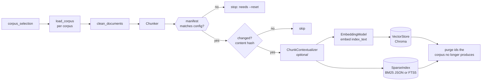
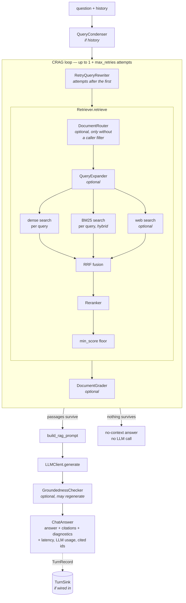

# Architecture

How the pieces connect at runtime: what runs when you build an index, what runs
when you ask a question, and which entrypoint goes through which part.

This doc is deliberately structural. It names config flags but not their
values, and gives no measurements — those live in `rag/config/config.yaml` and
[measured results](measured-results.md), and change far more often than the
shape described here. For *why* a stage is built the way it is, follow the
links into [milestone notes](milestone-notes.md).

## The two paths

The system is two pipelines that share one on-disk index and nothing else:

- **Index time** (`python -m rag.cli index`) — documents in, index out. Slow,
  run rarely, the only thing that writes.
- **Query time** (everything else) — question in, ranked passages or a cited
  answer out. Read-only with respect to the index.

Both are assembled from the swappable interfaces listed in `CLAUDE.md`
(`EmbeddingModel`, `VectorStore`, `Reranker`, `LLMClient`, `QueryExpander`,
`Chunker`), selected by config through each module's factory.

## Index-time path



All of it lives in `_cmd_index` in `rag/cli.py`; there is no separate indexing
service.

1. **Select and load.** `config.corpus_selection(names)` resolves which corpora
   to read and what to name the resulting index. Documents from every selected
   corpus are loaded, and a duplicate `Document.id` across corpora raises
   ([why](milestone-notes.md#named-corpora-notes-shipped-with-milestone-11)).
2. **Clean and chunk.** `rag/ingestion/cleaners.py`, then the configured
   `Chunker` (`rag/chunking/`). The chunker copies the document metadata keys
   named in `chunking.carry_metadata` onto each chunk (Markdown front matter
   is where EDGAR's company, ticker, form and dates come from), and renders
   `chunking.header.template` into each chunk's `header` when set.
3. **Check the manifest.** Before anything is written, the index's
   `index_manifest__<slug>.json` is compared with the configured embedder,
   `chunking.contextual` settings, carried metadata keys and header template. On a mismatch the run stops and asks for
   `--reset`, because what changed would alter vectors without altering chunk
   text, which is all the hash below can see. An empty index, or one that
   predates manifests, takes the current config.
   ([Index maintenance notes](milestone-notes.md#index-maintenance-notes))
4. **Skip what hasn't changed.** Each chunk's text is hashed and compared with
   the `content_hash` stored in the vector store's metadata. A chunk is
   re-processed if its hash differs **or it is missing from the BM25 index**:
   Chroma persists on every write but BM25 flushes once at the end, so an
   interrupted run can leave the two out of step.
5. **Contextualize (optional, `chunking.contextual`).** An LLM writes a short
   situating blurb per changed chunk, checkpointed to
   `contextual_cache.jsonl` keyed by prompt content — which is why the cache
   survives `--reset`. The hash in step 4 covers chunk text only, which is why
   step 3 guards these settings.
   ([Milestone 9 notes](milestone-notes.md#contextual-chunking-notes-milestone-9))
6. **Write both indexes.** The embedder embeds `chunk.index_text` (header +
   blurb + chunk, each when present), and BM25 tokenizes the same string, but
   the store keeps `chunk.text` verbatim, so retrieval
   matches the enriched string while citations quote the real source. BM25 is
   **always** built alongside the vectors, whatever `retrieval.mode` says, so
   switching to hybrid later never forces a re-embed.
7. **Purge stale chunks.** Chunk ids are positional, so a deleted document
   leaves all its chunks and a shortened one leaves its tail. Any id a store
   holds that this run didn't produce is deleted from that store, then BM25 is
   flushed.

### Storage naming

Everything a selection writes is named after its slug (sorted, `+`-joined
corpus names): Chroma collection `<base>__<slug>`, sparse index file
`bm25_index__<slug>.json` (or `fts5_index__<slug>.sqlite3` with
`sparse_index.provider: sqlite_fts5`), manifest `index_manifest__<slug>.json`. Isolated
and pooled indexes therefore sit side by side in `data/index/`, and a
query-time component built for one selection cannot read another's index.
`build_retriever` also refuses an index whose manifest names a different
embedder than the config, since those query vectors wouldn't be comparable.

## Query-time path

Two layers, and callers pick which one they need:

- **`Retriever`** (`rag/retrieval/retriever.py`) — question in, ranked passages
  out. No LLM unless query expansion is on.
- **A `ChatResponder`** (`rag/generation/chat_service.py`) — question in,
  answer with citations out. `chat.mode` picks which:
  - **`ChatService`** (`pipeline`) wraps a `Retriever` and adds
    condensing, CRAG, generation and citations. The diagram below is this path.
  - **`AgentService`** (`agentic`, the default since
    [ADR 0015](decisions/0015-agentic-default.md); `rag/agent/service.py`) lets the model
    call search as a tool, as often as it needs; see
    [below](#agentserviceask-chatmode-agentic).

  Both inherit `ask()` from `ChatResponder`, which owns what surrounds an
  answer (metering, timing, the turn record), so every entrypoint and eval
  runner works with either.



### `Retriever.retrieve`

0. **Filter or route.** A caller may pass a `QueryFilter`
   (`rag/query_filter.py`): equality, set membership and integer ranges over
   `document_id` and the `chunking.carry_metadata` fields. A field chunks don't
   store raises rather than matching nothing. Without a caller filter, the
   optional `DocumentRouter` (`retrieval.document_routing`) ranks one record
   per document by BM25 and dense, and when both put the same document first,
   builds a filter on it; otherwise retrieval runs unfiltered. A caller's
   filter always wins, and `RetrievalResult.routed_to` says what routing chose.
1. **Expand (optional, `retrieval.expansion`).** One query becomes several:
   HyDE passages for the dense side, rephrasings for both sides.
2. **Stage 1 — candidates.** Every (query, source) pair produces one ranked
   list: dense always; BM25 when `retrieval.mode` is `hybrid`; web search when
   `retrieval.web_search` is enabled. `top_k` applies per list. A filter is
   applied *inside* both indexes before their top-k (Chroma's `where`, BM25
   scoring only matching chunks), so it narrows what competes rather than
   trimming what won. Web search is skipped under a filter, since its results
   carry no corpus metadata.
3. **Fuse.** Reciprocal Rank Fusion merges the lists by rank, never by score,
   which is what makes lists from different queries and scoring functions
   safely comparable. A single non-empty list skips fusion entirely.
4. **Stage 2 — rerank.** The `Reranker` scores the fused candidates against the
   question-shaped queries (never a HyDE passage) and keeps `rerank_top_k`.
   With `reranker.include_header`, it scores each passage with its chunk
   header in front, which is what separates two periods' identical paragraphs.
5. **Floor.** Results below `retrieval.min_score` are dropped.

It returns a `RetrievalResult` carrying counts alongside the chunks, so
callers can tell "the index is empty" from "nothing relevant cleared the floor".
([Milestone 5 notes](milestone-notes.md#retrieval--reranking-notes-milestone-5);
filters and routing: [chunking plan](chunking-indexing-plan.md#phase-3--metadata-filtering-34-days),
Phases 3 and 3b)

### `ChatService.ask`

1. **Condense (`chat.condense_history`).** Only when history is passed: a
   follow-up is rewritten into a standalone question before retrieval.
2. **Retrieve with correction (`crag.*`).** Retrieval runs in a loop. With a
   grader, each attempt's passages are judged against the **original**
   question; an attempt that leaves nothing triggers a reworded retry. With
   CRAG off, this is exactly one `retrieve` call. A turn's `filters` (from
   `POST /chat`) apply to every attempt.
3. **No context → no LLM.** If nothing survives, it returns one of several
   explanatory answers (blank query, empty index, below floor, graded out)
   without generating.
4. **Generate.** The prompt answers the user's (condensed) question — never a
   CRAG retry rewrite, which is a search device only.
5. **Check groundedness (optional).** A failing answer is regenerated under a
   stricter prompt, up to `crag.max_regenerations`. The final verdict is
   reported on `ChatAnswer.grounded`, not used to withhold the answer.

The CRAG pieces live in `ChatService` rather than `Retriever` because retrying
and groundedness both need to see both sides of the retrieve/generate boundary.
([Milestone 10 notes](milestone-notes.md#corrective-rag-notes-milestone-10))

### `AgentService.ask` (`chat.mode: agentic`)

1. **History goes to the model as messages.** No condenser: the model sees
   the conversation and writes standalone queries itself. Earlier answers
   lose their `[n]` markers on the way in.
2. **The loop (`agent.strategy`).** `react`: the model is offered
   `rag_search` and decides after every result whether to search again.
   `planned`: one call's tool calls are the plan, all of them run, then one
   answering call.
3. **Every search goes through `RagTools.retrieve`**, the path MCP's
   `rag_search` uses, so it is `Retriever.retrieve` as above. The turn fixes
   `corpus`, `top_k` and `max_chars`; the model is offered the MCP schema
   minus those arguments. It chooses the query, and with
   `agent.model_filters` (off by default, unmeasured) a metadata filter,
   which narrows the turn's `/chat` filter and can't widen it. With
   `rag_list_documents` in `agent.tools` (also off by default) it can list the
   corpus's documents and their metadata; a listing is not a passage, so it
   isn't cited, but it spends the same `max_tool_calls` budget. With
   `calculator` (off by default) it can evaluate arithmetic over the figures
   it found (`rag.agent.calculator`, a safe `ast` evaluator, agent-only
   and not served over MCP); a calculation adds no passages and spends no
   retrieval-call budget, but its model step still spends time and tokens.
   Every call,
   refused or not, is recorded on `ChatAnswer.agent_calls`: query and
   filter as written, and the passages it returned.
4. **A passage ledger numbers what the model sees**, in first-seen order and
   deduplicated by chunk id. It becomes `ChatAnswer.citations`, so `[n]`
   means the same thing in both modes.
5. **Guards (`agent.*`)** end the searching: `max_tool_calls`, `timeout_s`,
   the turn deadline less its synthesis reserve (`turn_deadline_s`,
   `synthesis_reserve_s`, which also cut off a call in flight), the optional
   `max_turn_tokens`, a refused repeat query, a prompt that won't fit the
   context window (preflighted before it's sent), and a reply with neither
   text nor a tool call. Each ends in one tool-free call that must answer.
   `ChatAnswer.stopped_reason` says which guard fired. An answer call that
   can't run, or returns nothing, is a `ChatAnswer.generation_failure`, not
   an empty answer.
6. **Check groundedness (optional).** `crag.check_groundedness` checks the
   final answer against the ledger and only reports the verdict. CRAG's
   grader and retries don't apply.

It runs on its own model (`agent.llm`, falling back to `llm`) through
`build_agent_llm`, which refuses a provider without tool calling at build time.
([Milestone 19 plan](milestone-19-plan.md))

**Current boundary.** The ledger preserves shown passages and citation numbers;
it does not verify claim support or track unresolved research obligations.
Read/find navigation exists in `RagTools` and MCP, but is not yet offered by
`AgentService`. Navigation loads current cleaned files while search uses the
built index, so offsets can disagree after an edit. There is no pinned task
snapshot or resumable live-task store. The planned
[source-version](milestone-19-plan.md#source-version-consistency),
[per-task evidence-state](milestone-19-plan.md#per-task-evidence-state) and
[recovery](milestone-19-plan.md#long-running-research-recovery) contracts
describe extensions, not additional stages in the shipped path. Semantic
evidence/citation scoring remains owned by eval harness Phase 4a.

## Entrypoints

Every entrypoint builds its pipeline through one of two builders, so they all
get an identically configured stack from the same config.
`build_chat_service` (`rag/chat.py`) picks `build_pipeline_service`
(`rag/generation/builder.py`) or `build_agent_service` (`rag/agent/builder.py`)
by `chat.mode`:

| Entrypoint | Builder | Gets | Notes |
|---|---|---|---|
| `rag.cli retrieve` | `build_retriever` | passages | |
| `rag.cli chat` | `build_chat_service` | answer | single turn, no history; logs the turn |
| API `POST /chat` | `build_chat_service` | answer | built once in the app lifespan; takes history; logs the turn |
| API `POST /feedback` | — | — | appends a rating to the turn log |
| Streamlit UI | `build_chat_service` | answer | passes `on_event` for the live trace; logs turns and thumbs up/down |
| MCP `rag_search` | `build_retriever` | passages | one cached `Retriever` per selection |
| `rag.eval.retrieval_eval` | `build_retriever` | passages | |
| `rag.eval.answer_eval` | `build_chat_service` | answer | plus an LLM judge |
| `rag.eval.multihop_eval` | `build_chat_service` | answer | plus an LLM judge and evidence recall |

`build_chat_service` returns whichever `ChatResponder` `chat.mode` selects, so
every "answer" row above runs the agent in `agentic` mode. `POST /chat` and MCP
`rag_search` accept `filters`; the UI and `cli chat` don't expose them.

Two consequences worth knowing:

- **Retriever-only entrypoints skip everything in `ChatService`.** The MCP
  server, `cli retrieve` and the retrieval eval never condense, grade, retry or
  check groundedness, whatever `crag.*` says. An MCP client gets exactly what
  `cli retrieve` prints.
- **The API and the MCP HTTP transport share a process.** `/mcp` is a route on
  the FastAPI app when the `mcp` extra is installed, but builds its own
  `Retriever`s rather than reusing the chat service's.
  ([MCP server](mcp-server.md))

## Cross-cutting pieces

- **Config → factories → interfaces.** `load_config()` returns a validated
  `RagConfig`; each module's factory (`get_embedder`, `get_vector_store`,
  `get_reranker`, `get_llm_client`, `get_query_expander`, `get_chunker`) maps a
  `provider:` string to a concrete class. Nothing downstream of the builders
  names a concrete class.
- **One LLM client per `ChatService`.** `build_chat_service` creates a single
  `LLMClient` and hands it to the expander, condenser and every CRAG component.
  The agent has two: its loop runs on `agent.llm`, and query expansion and the
  groundedness check stay on `llm`.
- **Pipeline events.** `Retriever` and `ChatService` accept an optional
  `on_event` callback (`rag/events.py`) and call it once per completed stage
  with a timed `PipelineEvent`. Purely observational. `ChatService.ask` always
  tees the stream into the turn's own trace, which is where `ChatAnswer.stage_ms`
  and the persisted event list come from; the UI's live trace is the other
  consumer.
- **Turn records and metering (`rag/observability/`).** `build_chat_service`
  wraps the shared `LLMClient` in a `MeteredLLMClient`, so every LLM call a
  turn makes — from any component — is counted into that turn's
  `llm_calls`/tokens via a context-local meter. With a `TurnSink` passed in
  (the API, the UI and `cli chat` do; the eval runners don't), each turn —
  including one that raises — is written as one `TurnRecord`, and feedback
  from the UI or `POST /feedback` is appended to the same store, joined on
  `turn_id` at read time (`cli turns`).
  ([Milestone 12 notes](milestone-notes.md#observability-notes-milestone-12))
- **Diagnostics travel with results.** `RetrievalResult` and `ChatAnswer`
  carry what the pipeline did that the answer text can't show (rewritten query,
  expansion queries, dropped/graded-out counts, retry queries, groundedness), so
  every caller sees it, not just the one passing `on_event`.

## Package boundaries

Dependencies run one way, and `lint-imports` enforces it in CI:

```text
rag.chat          picks pipeline or agent by chat.mode (build_chat_service)
  rag.agent       the agent loop, its prompts, calculator and builder
    rag.generation   the retrieve-then-generate pipeline, CRAG, shared answer types
      rag.llm        model clients and the tool-calling interface
```

Each layer imports only the ones below it, so the pipeline never imports the
agent and the model clients import neither. Retrieval (`retrieval`,
`chunking`, `vectorstore`, `embedding`, `ingestion`, `tools`, `mcp`) imports
`rag.llm` but nothing above it, and the agent reaches retrieval only through
the `rag.tools` contract. Library code never imports an entrypoint. Why one
repo, and what the split does and doesn't separate:
[ADR 0016](decisions/0016-package-boundaries.md).

## Build vs. adopt

Which layers this repo implements and which it takes from established tools.
The rule: **build what the evals measure, adopt the plumbing.** A stage whose
behavior shows up in [measured results](measured-results.md) is written here,
so the numbers reflect this pipeline's own choices and not a framework's
defaults. Everything else uses a standard tool behind one of the interfaces
above, so it can be swapped in config.

| Layer | Built or adopted | Notes |
|---|---|---|
| Chunking, headers, contextual enrichment | Built | Measured in the chunking plan; a framework splitter would hide the offsets citations depend on |
| Retrieval, fusion, metadata filters, document routing | Built | Hybrid fusion and routing are measured decisions |
| Reranking policy | Built on an adopted model | `sentence-transformers` cross-encoder; when and how many to rerank is ours |
| Chat loop, CRAG, groundedness, agent | Built | LangGraph rejected ([CRAG notes](milestone-notes.md#corrective-rag-notes-milestone-10)) |
| Eval runners, scoring, paired comparison | Built | Inspect deferred, MLflow an optional tracking export ([eval harness decisions](eval-harness-plan.md#decisions-and-rejected-alternatives)) |
| Embedding and generation models | Adopted | Ollama for both; Gemini for generation; behind `EmbeddingModel` / `LLMClient` |
| Vector index, sparse index | Adopted | Chroma; `rank-bm25` or SQLite FTS5 |
| HTTP API, config validation, MCP transport | Adopted | FastAPI, pydantic, the `mcp` SDK (optional) |
| Tracing, IaC, hosting, auth at scale | Adopted (planned) | OpenTelemetry, Terraform, Cloud Run, an OIDC proxy ([backlog](backlog.md)) |

A new dependency still needs the justification in `CLAUDE.md` (what it replaces,
and why the existing tools don't cover it). "A framework does this" is not
enough on its own. A framework can still be useful at the edges, for example
as an eval comparator (its default pipeline run as one variant) or as a
client of the MCP server, without becoming a dependency of the pipeline.
