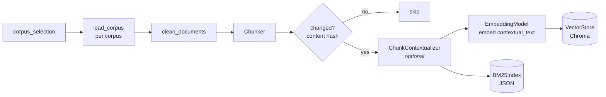
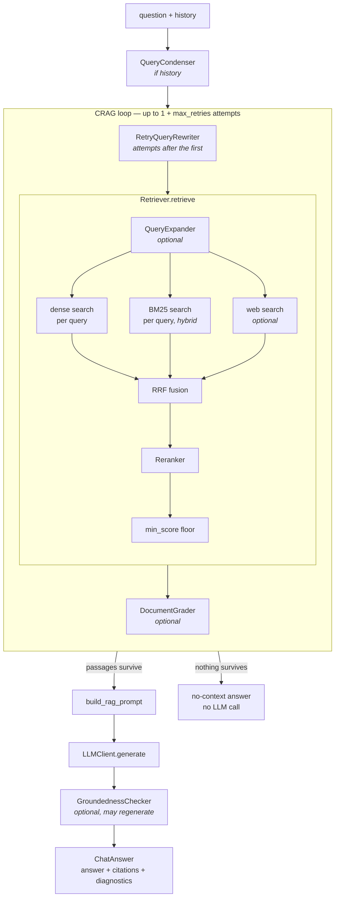

# Architecture

How the pieces connect at runtime: what runs when you build an index, what runs
when you ask a question, and which entrypoint goes through which part.

This doc is deliberately structural. It names config flags but not their
values, and gives no measurements — those live in `rag/config/config.yaml` and
[measured results](measured-results.md), and change far more often than the
shape described here. For *why* a stage is built the way it is, follow the
links into [milestone notes](milestone-notes.md).

## The two paths

The system is two pipelines that share one on-disk index and nothing else:

- **Index time** (`python -m rag.cli index`) — documents in, index out. Slow,
  run rarely, the only thing that writes.
- **Query time** (everything else) — question in, ranked passages or a cited
  answer out. Read-only with respect to the index.

Both are assembled from the swappable interfaces listed in `CLAUDE.md`
(`EmbeddingModel`, `VectorStore`, `Reranker`, `LLMClient`, `QueryExpander`,
`Chunker`), selected by config through each module's factory.

## Index-time path

All of it lives in `_cmd_index` in `rag/cli.py`; there is no separate indexing
service.

1. **Select and load.** `config.corpus_selection(names)` resolves which corpora
   to read and what to name the resulting index. Documents from every selected
   corpus are loaded, and a duplicate `Document.id` across corpora raises
   ([why](milestone-notes.md#named-corpora-notes-shipped-with-milestone-11)).
2. **Clean and chunk.** `rag/ingestion/cleaners.py`, then the configured
   `Chunker` (`rag/chunking/`).
3. **Skip what hasn't changed.** Each chunk's text is hashed and compared with
   the `content_hash` stored in the vector store's metadata. A chunk is
   re-processed if its hash differs **or it is missing from the BM25 index**:
   Chroma persists on every write but BM25 flushes once at the end, so an
   interrupted run can leave the two out of step.
4. **Contextualize (optional, `chunking.contextual`).** An LLM writes a short
   situating blurb per changed chunk, checkpointed to
   `contextual_cache.jsonl` keyed by prompt content — which is why the cache
   survives `--reset`. The hash in step 3 covers chunk text only, so toggling
   this flag needs an explicit `--reset`.
   ([Milestone 9 notes](milestone-notes.md#contextual-chunking-notes-milestone-9))
5. **Write both indexes.** The embedder embeds `chunk.contextual_text`
   (blurb + chunk), but the store keeps `chunk.text` verbatim, so retrieval
   matches the enriched string while citations quote the real source. BM25 is
   **always** built alongside the vectors, whatever `retrieval.mode` says, so
   switching to hybrid later never forces a re-embed.

### Storage naming

Everything a selection writes is named after its slug (sorted, `+`-joined
corpus names): Chroma collection `<base>__<slug>`, BM25 file
`bm25_index__<slug>.json`. Isolated and pooled indexes therefore sit side by
side in `data/index/`, and a query-time component built for one selection
cannot read another's index.

## Query-time path

Two layers, and callers pick which one they need:

- **`Retriever`** (`rag/retrieval/retriever.py`) — question in, ranked passages
  out. No LLM unless query expansion is on.
- **`ChatService`** (`rag/generation/chat_service.py`) — wraps a `Retriever`
  and adds condensing, CRAG, generation and citations.

### `Retriever.retrieve`

1. **Expand (optional, `retrieval.expansion`).** One query becomes several:
   HyDE passages for the dense side, rephrasings for both sides.
2. **Stage 1 — candidates.** Every (query, source) pair produces one ranked
   list: dense always; BM25 when `retrieval.mode` is `hybrid`; web search when
   `retrieval.web_search` is enabled. `top_k` applies per list.
3. **Fuse.** Reciprocal Rank Fusion merges the lists by rank, never by score,
   which is what makes lists from different queries and scoring functions
   safely comparable. A single non-empty list skips fusion entirely.
4. **Stage 2 — rerank.** The `Reranker` scores the fused candidates against the
   question-shaped queries (never a HyDE passage) and keeps `rerank_top_k`.
5. **Floor.** Results below `retrieval.min_score` are dropped.

It returns a `RetrievalResult` carrying counts alongside the chunks, so
callers can tell "the index is empty" from "nothing relevant cleared the floor".
([Milestone 5 notes](milestone-notes.md#retrieval--reranking-notes-milestone-5))

### `ChatService.ask`

1. **Condense (`chat.condense_history`).** Only when history is passed: a
   follow-up is rewritten into a standalone question before retrieval.
2. **Retrieve with correction (`crag.*`).** Retrieval runs in a loop. With a
   grader, each attempt's passages are judged against the **original**
   question; an attempt that leaves nothing triggers a reworded retry. With
   CRAG off, this is exactly one `retrieve` call.
3. **No context → no LLM.** If nothing survives, it returns one of several
   explanatory answers (blank query, empty index, below floor, graded out)
   without generating.
4. **Generate.** The prompt answers the user's (condensed) question — never a
   CRAG retry rewrite, which is a search device only.
5. **Check groundedness (optional).** A failing answer is regenerated under a
   stricter prompt, up to `crag.max_regenerations`. The final verdict is
   reported on `ChatAnswer.grounded`, not used to withhold the answer.

The CRAG pieces live in `ChatService` rather than `Retriever` because retrying
and groundedness both need to see both sides of the retrieve/generate boundary.
([Milestone 10 notes](milestone-notes.md#corrective-rag-notes-milestone-10))

## Entrypoints

Every entrypoint builds its pipeline through one of two builders, so they all
get an identically configured stack from the same config:

| Entrypoint | Builder | Gets | Notes |
|---|---|---|---|
| `rag.cli retrieve` | `build_retriever` | passages | |
| `rag.cli chat` | `build_chat_service` | answer | single turn, no history |
| API `POST /chat` | `build_chat_service` | answer | built once in the app lifespan; takes history |
| Streamlit UI | `build_chat_service` | answer | passes `on_event` for the live trace |
| MCP `rag_search` | `build_retriever` | passages | one cached `Retriever` per selection |
| `rag.eval.retrieval_eval` | `build_retriever` | passages | |
| `rag.eval.answer_eval` | `build_chat_service` | answer | plus an LLM judge |

Two consequences worth knowing:

- **Retriever-only entrypoints skip everything in `ChatService`.** The MCP
  server, `cli retrieve` and the retrieval eval never condense, grade, retry or
  check groundedness, whatever `crag.*` says. An MCP client gets exactly what
  `cli retrieve` prints.
- **The API and the MCP HTTP transport share a process.** `/mcp` is mounted on
  the FastAPI app when the `mcp` extra is installed, but builds its own
  `Retriever`s rather than reusing the chat service's.
  ([MCP server](mcp-server.md))

## Cross-cutting pieces

- **Config → factories → interfaces.** `load_config()` returns a validated
  `RagConfig`; each module's factory (`get_embedder`, `get_vector_store`,
  `get_reranker`, `get_llm_client`, `get_query_expander`, `get_chunker`) maps a
  `provider:` string to a concrete class. Nothing downstream of the builders
  names a concrete class.
- **One LLM client per `ChatService`.** `build_chat_service` creates a single
  `LLMClient` and hands it to the expander, condenser and every CRAG component.
- **Pipeline events.** `Retriever` and `ChatService` accept an optional
  `on_event` callback (`rag/events.py`) and call it once per completed stage
  with a timed `PipelineEvent`. Purely observational — the UI's trace is the
  only current consumer, and it is the natural hook for Milestone 12.
- **Diagnostics travel with results.** `RetrievalResult` and `ChatAnswer`
  carry what the pipeline did that the answer text can't show (rewritten query,
  expansion queries, dropped/graded-out counts, retry queries, groundedness), so
  every caller sees it, not just the one passing `on_event`.
