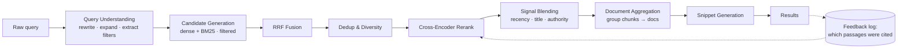

# Backlog

Planned work, roughly in dependency order. Shipped milestones are marked
*(shipped)*; the first unmarked one is next. The
existing pipeline is feature-rich on the *retrieval/generation* axis and thin
on everything that surrounds it — measurement, operations, and input quality —
which is what this list is.

Every item keeps the project's existing rules: config-selected behind an
interface, off by default until measured, hermetic tests, no second HTTP
client / YAML parser / etc.

**Deliberately not on this list: a query router.** Retrieval is unconditional
by design (see the Chat API notes in `docs/milestone-notes.md`) — every
question asked of a corpus Q&A tool is supposed to be corpus-shaped, so a
classifier deciding whether to retrieve would add an LLM call and a failure
mode to buy back a case that shouldn't arise. The version of that idea worth
building is a different thing entirely — the model calling search itself —
which is Milestone 19, and it subsumes routing rather than adding it as a
stage.

### Milestone 11 — Measure Milestones 9 & 10 *(shipped)*

First, because it gates the value of everything else. Contextual chunking and
CRAG both shipped functionally verified and numerically unmeasured, and the eval
harness to fix that already exists.

- `retrieval_eval` with `chunking.contextual.enabled` off vs. on (`--reset`
  between runs; the content hash doesn't cover `context`).
- `answer_eval` with `crag.enabled` off vs. on, and with each of
  `grade_documents` / `check_groundedness` isolated.
- Same for `retrieval.expansion` (`none` / `hyde` / `multi_query`) and
  `reranker.aggregate`, which are equally unmeasured. Expansion is
  non-deterministic — repeat runs or accept the noise, don't read one run as a
  result.
- Record the numbers somewhere durable (`docs/measured-results.md`, or
  `data/eval/results/`), including corpus size and config, since a metric with
  no config attached is unreproducible.

Expect a defaults change to fall out of this, and possibly a retune of
`retrieval.min_score`.

### Milestone 12 — Observability *(shipped)*

Shipped as planned, with one correction to the premise below: `ChatService`
did **not** already know which passages were cited — `citations` was every
passage shown. It now parses the `[n]` markers (`parse_cited_passages`) and
reports `cited_chunk_ids` separately. What shipped and why:
[milestone notes](milestone-notes.md#observability-notes-milestone-12).
Not done here: stage-1 (pre-rerank) candidate ids aren't recorded, since
`Retriever` doesn't return them, and no OpenTelemetry adapter exists yet.

Today a turn's reasoning is visible only live, via `PipelineEvent` in the UI
trace; nothing is persisted, and no turn reports what it cost or how long it
took. That makes regressions invisible and makes the eval set the only source
of signal about quality.

- Persist per-turn records — query, rewritten/expanded queries, retrieved and
  final chunk ids, scores, citations, the CRAG verdicts, answer.
- Per-stage latency and LLM call/token counts on `ChatAnswer`, surfaced on
  `ChatResponse` like the other pipeline-transparency fields.
- Thumbs up/down in the UI, written to the same store — logged queries with
  feedback are the cheapest source of new eval samples, and the eval set is
  hand-authored today.
- `ChatService` already knows which passages the model cited as `[n]` — log
  `(query, candidates_shown, cited_chunk_ids)` as an implicit relevance
  judgment on every turn, not just when a user clicks thumbs up/down. Cheap to
  add alongside the explicit signal, and it compounds: enough judgments
  eventually train a learning-to-rank model behind the existing `Reranker`
  interface.
- Keep the sink behind an interface (`local JSONL` default) rather than
  reaching for a tracing SaaS; OpenTelemetry export is a later adapter.

### Milestone 13 — Query result caching

Nothing is cached anywhere. Repeat and near-repeat queries re-pay embedding,
retrieval, reranking, and generation in full — most visible in demos and evals,
where the same questions run over and over.

- Exact-match first (normalized query + a config fingerprint → answer). Simple,
  correct, and enough for the eval/demo case.
- Semantic cache (query embedding → nearest cached query above a threshold) as
  a second tier, behind its own config flag. Note that this can serve a wrong
  answer where the exact cache can't, so it needs a conservative default
  threshold and a way to see when it hit.
- **The cache key must include the config that produced the entry** — chunking,
  retrieval, reranker, CRAG settings. Serving a pre-CRAG answer after enabling
  CRAG would silently poison Milestone 11's numbers.
- Cache the *answer*, not just reranked docs: generation is the expensive stage
  here (one local 9b call, more with CRAG).

### Milestone 14 — Richer document parsing

`pypdf` gives page text and nothing else. Tables arrive as collapsed
whitespace, headings are indistinguishable from body text, and a scanned PDF
yields an empty `Document` with no error. This is the highest-leverage quality
work in the list: no amount of retrieval sophistication recovers information
the parser threw away.

- A structure-aware parser behind the existing loader interface (Docling or
  `unstructured`) emitting tables and headings as such. Both are heavy
  dependencies — justify against the "keep dependencies minimal" rule, and keep
  `pypdf` as the default until the upgrade is measured.
- Section headings into `Chunk.metadata`, which improves citations and gives
  Milestone 15 something structural to split on.
- Detect an empty/near-empty extraction and warn rather than indexing nothing.
  OCR fallback is optional and probably an adapter, not a default.
- A page-image / Vision-Language embedding path (e.g. ColPali) is a heavier
  alternative worth naming for layout-dense pages — scanned forms, dense
  tables — where even a structure-aware text parser loses information a page
  screenshot wouldn't. Not the default; a later adapter behind the same
  loader interface if the text-based parser proves insufficient.

### Milestone 15 — Semantic chunking

Fixed-size character windows split mid-argument; contextual chunking patches
the symptom at index time. A `SemanticChunker` slots behind the existing
`Chunker` interface: embed sentences, cut where adjacent-sentence similarity
drops below a threshold.

- Costs embedding calls at index time, on top of contextualization if that's on.
- Depends on Milestone 14 for the structure-aware variant (split on real
  headings first, semantically within a section).
- Token-aware chunking is the other long-standing option behind this interface
  and can share the milestone.
- Compare against `fixed` with Milestone 11's harness before changing the
  default.
- Parent-child retrieval is a complementary technique, not a chunking
  strategy change: embed small child chunks for search precision but return
  the surrounding parent chunk — plus a breadcrumb like
  `Document > Section 4.2`, built from Milestone 14's headings — to the LLM.
  Fits behind `Retriever` as an expansion step after ranking, not behind
  `Chunker`.

### Milestone 16 — Async ingestion

`python -m rag.cli index` is synchronous, single-process, and has no
checkpoint/resume — a contextual re-index of a large corpus is a long job that
loses everything if interrupted. That's already called out as a limitation.

- Checkpoint/resume first: persist per-chunk progress so an interrupted run
  restarts where it stopped. This is the part that matters at any scale and
  doesn't require a queue.
- Then a job/worker split behind an interface, so ingestion can be triggered
  by an API call rather than a terminal. Local default: an in-process or
  file-backed queue — not a hosted queue, which belongs with Milestone 18.
- Concurrency for the per-chunk LLM/embedding calls (contextualizer, and the
  CRAG grader on the query side) — currently sequential for parse reliability.

### Milestone 17 — PII detection & redaction

Nothing inspects document content today. A corpus with personal data gets
embedded, persisted to disk, and quoted back verbatim in citations.

- A detection pass in the ingestion pipeline, alongside `clean_documents` and
  explicitly separate from it, so it can be inspected or skipped.
- Regex/heuristic detectors as the local default (emails, phones, national ids,
  card numbers); a cloud DLP adapter behind the same interface if ever needed.
- Decide and document the policy per finding — redact in place, drop the
  document, or warn and index anyway — and keep it configurable. Redaction
  changes `Chunk.text`, which is otherwise sacred (see Milestone 9), so the
  interaction with citations and `char_start`/`char_end` needs thought.
- Off by default; it costs an ingestion pass and can mangle legitimate text.

### Milestone 18 — Deployment

The project is local-first by design and should stay runnable with nothing but
Ollama. Deployment is about proving the interfaces are real, not about moving
off local.

- Containerize the API; a scale-to-zero container host is the natural target
  since traffic is bursty and the app holds no session state (`history` is
  caller-supplied precisely so this works).
- Hosted `LLMClient` / `EmbeddingModel` adapters. `LLMConfig.provider` already
  validates `anthropic`/`openai` and raises "recognized but not implemented" —
  this is where that gets closed.
- A local, non-Ollama `EmbeddingModel` adapter (`sentence-transformers`,
  already a dependency via `CrossEncoderReranker`) is worth adding alongside
  the hosted ones — same interface, no daemon required.
- A hosted `VectorStore` adapter (Chroma's own server mode is the smallest
  step; Qdrant or similar if a managed tier is wanted).
- The claim to earn: swapping any of these is a config change, no pipeline
  code touched. If it isn't, that's an interface bug worth finding.

### Milestone 19 — Agentic retrieval

**Planned:** see [Milestone 19 plan](milestone-19-plan.md) for the phased
implementation and the pre-work measurements behind it.

Expose search as a **tool the answering model calls**, rather than a stage that
always runs before it. Unlike the rest of this list, this one *replaces* shipped
behavior — it's the largest item here and the only one that can make the system
worse, so it lands last and behind a flag, with the current path staying the
default until measured.

What it subsumes, and why that's the argument for it:

- **Routing**, without a classifier. "Does this need the corpus?" stops being a
  separate LLM call whose verdict can be wrong in a way nothing detects, and
  becomes the model declining to call the tool.
- **Query condensing.** A model holding the conversation resolves "what about
  part-time staff?" by writing a better tool call. The dedicated condense round
  trip (`chat.condense_history`) exists because retrieval is stateless and the
  answering model never sees history — both premises go away here.
- **Multi-hop questions**, which the current pipeline cannot serve at all: one
  retrieval, one generation, no way to search again on what the first search
  turned up. CRAG's retry loop is the closest thing and it only fires on
  *failure*, re-asking the same question differently rather than asking a new
  one.
- **Conversational turns** ("summarize what you just told me") — a documented
  limitation today, since history reaches only the condenser.

What it costs, stated plainly because this is a real tradeoff:

- **`LLMClient` has to grow.** `generate(prompt, *, system=None) -> str` has no
  tool-calling and no multi-turn message list; a one-method ABC becomes a
  conversation loop with tool definitions, tool results, and a stop condition.
  Every adapter follows. That is the single biggest interface change the
  project has made.
- **Non-determinism and unbounded cost.** Turns become 1–N LLM calls with N
  decided by the model. Needs a hard call cap, like `crag.max_retries` but
  load-bearing rather than a safety net.
- **The local 9b model has to be good at tool calling**, which is a different
  skill from answering, and `docs/known-limitations.md` already notes every
  judgment in this pipeline runs on that one model. If it calls search
  erratically, this is strictly worse than always retrieving — which is the
  outcome to measure for.
- **Evals need rethinking.** `retrieval_eval` assumes exactly one retrieval per
  query with a fixed k; here there may be zero, or four with different queries.
  Expect a new metric shape, not just new numbers.

Design notes for whoever picks this up:

- The tool should wrap the **existing `Retriever`**, hybrid/expansion/floor and
  all — this milestone changes *when* retrieval happens and who decides, not
  how it works.
- CRAG is largely redundant with a competent agent loop (grading and retrying
  are what a model does natively between tool calls) but should stay switchable
  and independently measurable rather than being deleted alongside.
- Citations get harder: passages arrive across several tool calls, so the
  `Passage [n]` numbering that is currently the single source of truth mapping
  `[n]` → `Citation` needs to survive accumulation across calls.
- Keep it behind config (`chat.mode: pipeline | agentic`) so the two paths can
  be compared on the same eval set. Comparing them is the point of the
  milestone; shipping the agent isn't.

### Milestone 20 — Search-quality layer

The pipeline is *RAG*-shaped: one query in, `rerank_top_k` chunks out, straight
into a prompt. A *search-engine* shape adds a query-understanding stage before
retrieval and a result-assembly stage after ranking — worth it once the corpus
is browsed as well as asked questions of (a UI/API consumer paging results),
not just answered against.

- **Structured `Query` object + filter pushdown**, land first — it touches
  `VectorStore.query`, `SparseIndex.query`, and `Retriever.retrieve`, so
  everything below is cheaper once it exists. Replace the raw `str` query with
  `text`/`expansions`/`filters`/`intent`; add `filters: QueryFilter | None` to
  both index query methods; push predicates into Chroma's `where` clause and a
  BM25 pre-filter. Parse `type:pdf`, `after:2026-01-01`, `path:handbook/` out
  of raw query text.
- **Query understanding, distinct from routing.** This is not the retrieve-or-
  not classifier rejected above — it's normalization, spell correction, and
  expansion parsing on a query that's already going to be searched, plus using
  intent (navigational/factual/exploratory) to vary `top_k` and reranking
  depth. Should share one `LLMClient`-backed rewriter with the existing
  condenser/HyDE code rather than duplicating that seam.
- **Document-level aggregation.** The eval suite already matches at document
  level (`chunk.document_id`); the pipeline still returns chunks. Group
  `ScoredChunk`s by `document_id`, score each document (max, or sum of its
  top-*n* chunk scores), and return a `ScoredDocument` with its best passage —
  needed for a UI/API that lists results rather than answers one question.
- **Dedup & diversity (MMR).** `chunk_overlap: 150` guarantees adjacent chunks
  share text, so near-duplicates can consume the whole `rerank_top_k` budget.
  Collapse near-duplicates post-fusion (SimHash or an embedding-cosine
  threshold) and apply MMR or a per-document result cap.
- **Query-independent ranking signals.** Every score today is pure
  query–chunk similarity; nothing says one document is simply *better* than
  another — recency (file mtime / parsed document date, neither captured
  today), structural position (title/heading match — `title` already rides in
  `Chunk.metadata`, unused for scoring), and an intra-corpus link-graph
  authority prior for Markdown docs that cross-reference each other.
- **Snippet generation.** Full chunk text (~1000 chars) goes to both the
  prompt and the UI regardless of how long the relevant span is; select the
  best query-biased sentence window and mark matched terms.
- **BM25F.** `tokenize()` in `rag/retrieval/sparse.py` is a bare regex — no
  stemming, no stopwords, no distinction between a title match and a body
  match. Add both, shared between the index and query paths so they stay
  consistent; move to per-field weights (title/headings/body) once Milestone
  14 gives the index real fields to weight.
- **Deletion support.** Neither `VectorStore` nor `SparseIndex` exposes
  `delete(ids)` — a document removed from a corpus leaves orphaned vectors and
  BM25 records permanently. Diff the corpus's current chunk ids against each
  index's at index time and purge the difference; pairs naturally with the
  incremental-indexing change-detection that already ships (`rag/cli.py`).
- **Scalable sparse backend**, only once corpus scale demands it. `BM25Index`
  holds every chunk's text in a Python dict, persists as one JSON blob, and
  rebuilds the whole index after any upsert — workable to roughly 10⁴ chunks,
  degrades beyond. SQLite FTS5 or Tantivy behind the existing `SparseIndex`
  ABC is a straight substitution; no pipeline code should need to change.
- Query result caching is **not** repeated here — it's Milestone 13, already
  scoped with the config-fingerprint requirement a naive cache would miss.
- Suggested build order: filter pushdown (shared interfaces) → aggregation +
  dedup (largest visible result-quality win) → ranking signals (title match
  and recency first, link graph later) → snippets → BM25F → deletion support
  (pair with incremental indexing) → scalable backend (last, scale-gated).

### Milestone 21 — Streaming & citation fidelity

Two answer-delivery gaps, grouped because both sit at the `ChatService` →
API/UI boundary rather than in retrieval:

- **SSE streaming.** `/chat` and the UI wait for the full generation call
  before showing anything, which reads as high latency on long answers. Needs
  `LLMClient.generate_stream(prompt, *, system=None)` yielding token chunks
  (every adapter implements it, mirroring the existing `generate` ABC), a
  `POST /chat/stream` route returning `text/event-stream`, and
  `rag/ui/app.py` rendering via `st.write_stream`. Citations and the
  pipeline-trace fields only make sense once generation finishes, so the
  stream is answer-text-only — the existing non-streaming response stays the
  source of truth for citations.
- **Active citation filtering.** `ChatAnswer.citations` currently returns
  every retrieved passage, whether or not the model's answer actually cited
  it, so a UI/API consumer can't tell which passages were load-bearing from
  which were context the model ignored. Parse `[n]` tags out of the generated
  text and annotate — not silently drop, an uncited passage is still evidence
  a user may want — each `Citation` with `cited: bool`.

### Milestone 22 — Reference-free eval metrics

`answer_eval` needs a hand-written `expected_answer` to grade against, so a
corpus question with no reference answer can't be evaluated at all today.
RAG-triad-style metrics don't need one:

- **Faithfulness/groundedness** — already exists as a runtime check
  (`GroundednessChecker`, Milestone 10); reuse it as a metric so it can be
  reported per eval run instead of only inferred from a live `grounded` flag.
- **Answer relevance** — does the answer address the question asked,
  independent of whether it's *correct*. New judgment, no existing component
  to reuse.
- **Context relevance** — what fraction of retrieved chunks were actually
  pertinent. Close to what `DocumentGrader` (Milestone 10) already judges
  per-passage; running it as an eval metric over the retrieval eval set gives
  a number without needing CRAG enabled at runtime.
- MAP (mean average precision) is a smaller, cheaper addition to
  `rag/eval/metrics.py` alongside the existing NDCG@k — worth adding in the
  same pass since both are pure functions over gains.

### Milestone 23 — Eval regression gate in CI

CI runs `ruff`, `mypy` and `pytest`, all hermetic, so nothing stops a change
that makes answers or retrieval worse from merging. The eval harness exists
and the noise floor is measured; nothing runs it automatically. It depends on
nothing else in this list and is worth pulling ahead of it.

- **Retrieval, gated on every PR.** `retrieval_eval` on the EDGAR eval set,
  failing the build when hit rate or NDCG drops by more than the measured noise
  floor (SE ≈ 2.5pp at n=174, see `docs/measured-results.md`) against a
  committed baseline result. A threshold tighter than the noise floor fails
  on chance; a looser one lets real regressions through.
- **The index is the hard part.** A GitHub runner has no Ollama, no EDGAR
  documents (gitignored and deliberately not redistributed), and no GPU. Build
  it once from `manifest.json` in a CI job and store it with `actions/cache`,
  keyed on the manifest, the `FINGERPRINTED` chunking settings and the
  embedding model, so it rebuilds only when one of those changes. Commit the
  174 eval queries' embeddings (derived from our own questions, not the
  corpus) so the per-PR run needs no embedding server at all.
- **Check the reranker fits the time budget.** `bge-reranker-v2-m3` took
  ~1.1s/query on Apple Silicon; a CPU runner will be slower. If the full set is
  too slow per PR, gate on a fixed stratified subset and run all 174 nightly.
  Report the subset's own noise floor; it is wider than the full set's.
- **Answer quality, nightly or on demand, not per PR.** `answer_eval` needs a
  generator and a judge (both local LLMs), and run-to-run variance is already
  ±2 samples at n=40. A nightly job on a self-hosted runner with Ollama can
  track it and flag a regression; making it block merges would mostly block
  on noise.
- **The quick alternative, and why it isn't enough:** gating on the committed
  `baseline` corpus with a small embedder is cheap and fully hermetic, but it
  gates a 31-chunk toy corpus that none of the measured results come from.
  Worth having as a smoke test alongside, not instead.
- The baseline result file gets updated deliberately, in the same PR as a
  change that intends to move the numbers, never automatically, or the gate
  ratchets toward whatever the last merge scored.

### Milestone 24 — Latency percentiles and cost per query

The measured results report total wall-clock seconds per eval run. That hides
the tail: a mean can look fine while one query in twenty takes 10x longer.
Every turn already records per-stage timings (`TurnRecord.stage_ms`), and
`answer_eval` times each sample, but nothing summarizes either.

- p50/p95 (and max) per stage and end to end, reported by `retrieval_eval`,
  `answer_eval` and `run_matrix.py` next to the quality metrics, and by
  `python -m rag.cli turns` over logged traffic. `retrieval_eval` needs
  per-query timing added first; it doesn't time samples today.
- Add latency columns to the tables in `docs/measured-results.md`, starting
  with the reranker comparison, where the tradeoff (v2-m3: +10.4pp hit for
  ~4x latency) is currently stated as a mean.
- Cost per 1,000 queries: tokens are already metered (`UsageMeter`); price
  them per model from config. With local Ollama the dollar figure is $0 and
  the meaningful number is tokens and seconds per query. It becomes a real
  cost once Milestone 18's hosted adapters land, so price the hosted models
  in config rather than hardcoding a $0.
- Use the same percentile code for evals and logged turns, so an eval latency
  and a production latency are measured the same way.

### Milestone 25 — Chunk size and overlap sweep

`chunking.chunk_size` and `chunk_overlap` are in `run_matrix.py`'s fingerprint
but have never been varied. The matrix excludes them because each value needs
its own index build, not a config flip. The shipped values were never tuned
on EDGAR.

- A small grid (e.g. size 500 / 1000 / 2000 × overlap 0 / 150 / 300), each
  built into its own `index_dir` the way the contextual comparison did it
  (`data/eval/config_contextual.yaml`), since the collection name is derived
  from the corpus selection alone and would otherwise be overwritten.
- **Chunk size changes what a hit means.** The eval set matches answer spans,
  and a larger chunk contains more spans by construction, so hit rate goes up
  with size even if the reranker gets no better. Report NDCG, and the
  prompt-token cost of `rerank_top_k` chunks of that size, alongside hit rate.
- Record chunk-boundary failures: samples whose answer span is split across
  two chunks at one size and whole at another. This is the concrete
  before/after for the failure-analysis section, and it tells Milestone 15
  (semantic chunking) whether boundaries are actually the problem.
- Run after Milestone 23 if possible, so the chosen defaults become the CI
  baseline. Check at least one size against a second reranker rather than
  assuming the best size is independent of it: the MiniLM-vs-BGE pool-size
  reversal in `docs/measured-results.md` is the precedent.

### Milestone 26 — OpenTelemetry trace export

The turn log is local JSONL, read by `python -m rag.cli turns`. That is
deliberate (Milestone 12), and the sink sits behind an interface so an
exporter can be another adapter (`rag/observability/sink.py`). What the JSONL
can't give: a trace view of the stages as spans, search over many turns, and
comparing latency across deployments.

- An OpenTelemetry exporter behind the existing sink interface, one span per
  pipeline stage (the `stage_ms` keys), LLM calls as child spans carrying
  token counts, and the turn's retrieved/cited chunk ids as attributes.
- Point it at a self-hosted Arize Phoenix or Langfuse via config. Both accept
  OTLP, so the adapter is written against OTel and not either vendor's SDK.
  That keeps it one dependency (the OTel SDK) and swappable between them.
- JSONL stays the default. The OTel sink is off unless configured, and the
  eval runners still log nothing.
- Justify the OTel SDK against the minimal-dependencies rule. It is the
  standard, and hand-writing OTLP would be worse, but it is a new dependency.
- Most useful after Milestone 18, when there is a deployment to trace, and
  after Milestone 19, when a turn becomes 1–N tool calls a flat record reads
  poorly.
