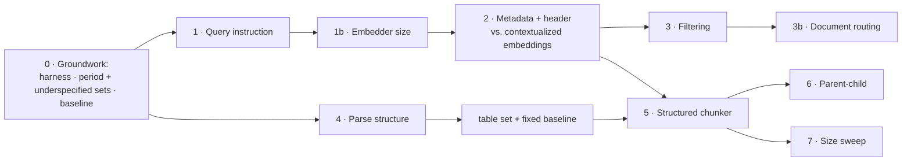

# Chunking and indexing plan

How production RAG systems chunk and index documents, where this repo stands
against that, and the phased work to close the gap. It pulls together pieces
the backlog spreads across several milestones: parsing
([14](backlog.md#milestone-14--richer-document-parsing)), chunking
([15](backlog.md#milestone-15--semantic-chunking)), filter pushdown
([20](backlog.md#milestone-20--search-quality-layer)), the size sweep
([25](backlog.md#milestone-25--chunk-size-and-overlap-sweep)) and the
underspecified question tier
([27](backlog.md#milestone-27--eval-coverage-and-judge-reliability)).
The backlog says *what*; this says *how*, in what order, and what has to be
true before each step counts as done.

Every phase follows the project's rules: selected by config behind an existing
interface, off by default until measured with the `measure-change` skill, and
no new dependency without a stated reason.

Evaluation scope and the next benchmark work are specified in the
[evaluation rigor plan](evaluation-rigor-plan.md). The existing three EDGAR
tiers remain development controls for these phases. They do not replace a
fresh holdout, evidence-aware answer grading, or questions authored without
the current chunk boundaries; generated single-span questions alone cannot
establish that a chunking strategy is generally better.

## The production methodology

Indexing is a pipeline with a contract at each stage, not a chunker with an
embedder attached. The stages, and what each is responsible for:

1. **Parse into structure.** A layout-aware parser returns typed elements —
   headings, paragraphs, lists, tables — not a flat string. Everything after
   this depends on it: information the parser discards can't be recovered by
   any later stage. Markdown is the usual interchange format (Docling,
   Unstructured and LlamaParse all export it), so one downstream chunker can
   serve every source format.
2. **Normalize.** Strip page furniture (running headers, "Table of Contents"
   links, page numbers) and fix encoding. Never rewrite content.
3. **Attach document metadata.** Entity, document type, date or period,
   source, version, access-control tags. These go in typed fields that the
   store can filter on, not only in free text.
4. **Chunk along the structure, with a size cap.** Split recursively (section,
   then paragraph, then sentence), into chunks of a few hundred tokens. Keep
   tables whole, or split them by rows with the header row repeated in every
   piece. Record each chunk's heading path. Whether overlap helps is an open
   empirical question (the 2026 studies below disagree), so it is a measured
   parameter, not a default.
5. **Assemble the index text separately from the chunk text.** What gets
   embedded and keyword-indexed is a header (document identity plus heading
   path), optionally an LLM-written context line, then the chunk. What gets
   cited is the verbatim chunk. Anthropic's "contextual retrieval" is the
   LLM-written version of this header. The deterministic version is free.
6. **Embed the way the model was trained.** Use asymmetric models as intended.
   Many need an instruction on the query side only. Since 2025 a second option
   exists: *contextualized chunk embedding* models (Voyage's
   `voyage-context-3`/`-4`, and late chunking in open models) take the whole
   document with its chunks and return one vector per chunk that already
   encodes document context. They do in the embedder what stage 5's header
   does in the text.
7. **Store for both relevance and filtering.** Dense and sparse indexes over
   the same chunk ids, with the metadata from stage 3 queryable as predicates.
8. **Validate before publishing.** Check chunk counts and size distribution,
   tables split mid-body, empty documents, duplicates, and the index's
   settings fingerprint. Then run a retrieval eval gate.
9. **Publish atomically.** Build a new index version, validate it, switch
   readers over, and keep the old version for rollback.

What the published evidence says, checked against sources as of September
2026. 2026 studies come first; each earlier result is listed with whether
later work confirms, qualifies or contradicts it.

- **Semantic (embedding-similarity) chunking still isn't worth its cost.**
  A May 2026 study of eight chunkers on nine QA datasets (bge-m3,
  `bge-reranker-v2-m3`) found fixed-size chunking at 87.7% Accuracy@5 in
  under a second, and the best semantic method at 89.4% in about 5 minutes.
  The LLM-driven chunker took over 8 hours and timed out on part of the data.
  Its conclusion: "more computationally expensive chunking methods do not
  yield meaningful effectiveness improvements." A January 2026 study (SPLADE,
  Natural Questions) found sentence chunking matched semantic chunking up to
  ~5k tokens of context at lower cost. *Confirms* Vectara's October 2024
  finding that semantic chunking's cost is "not justified by consistent
  performance gains."
- **Overlap: the 2026 evidence conflicts.** The January 2026 study found
  overlap gave "no measurable benefit" on Natural Questions. An ICSE-SEIP 2026
  study on financial PDFs (FinanceBench plus a table benchmark) found 25%
  overlap lifted page-level MRR from 0.529 to 0.658, while 50% overlap added
  nothing more and doubled the index. Those are different corpora, retrieval
  units and metrics. On filings, the domain here, the evidence favours some
  overlap. That's why this plan measures overlap instead of assuming it away
  (Phases 5 and 7).
- **Strategies differ by a few points of recall; size moves precision.**
  Chroma's 2024 evaluation put recall at 83.6–91.9% across strategies (an
  earlier version of this doc said 88–92%, which dropped the worst row: the
  Kamradt semantic chunker). Halving chunk size roughly doubled precision
  within a strategy. Still consistent with the 2026 studies above; no later
  source contradicts it.
- **Structure-driven chunkers aren't a free win either.** The ICSE-SEIP 2026
  study found its structure-driven chunkers "add index size without
  consistent accuracy gains" over sentence chunking. Its "structure" meant
  semantic-boundary variants, not headings and tables, so it doesn't test
  Phase 5's design. No 2026 source found here tests heading- and table-aware
  chunking on filings. Phase 5 therefore rests on this corpus's own measured
  defect (543 mid-table chunks), not on outside evidence.
- **For financial filings, document context beats boundary cleverness.**
  Snowflake (March 2025, ~23,000 10-K/10-Q PDFs, Arctic-Embed 2.0) found
  Markdown-aware splitting beat fixed splits by 5–10%, and that "once
  document-level contexts are appended, the differences between markdown and
  plaintext chunking strategies shrink." (An earlier version of this doc said
  the gain held "only when no document context was added"; the source says it
  shrinks, not that it vanishes.) Prepending company, filing date and form
  type lifted answer accuracy from about 50–60% to 72–75%, their largest
  effect. About 1,800-character chunks worked best. No 2026 source
  contradicts it. The contextualized-embedding results below point the same
  way: document context is the lever.
- **Contextualized chunk embeddings beat context written into the text.**
  Voyage reports `voyage-context-3` (July 2025) beating Anthropic-style
  contextual retrieval by 6.76% and Jina late chunking by 23.66% on
  chunk-level retrieval. It reports `voyage-context-4` (June 2026) at +2.08%
  NDCG@10 over `-3` across 39 datasets in 8 domains, finance included. These
  are vendor benchmarks and the test sets aren't public, so treat them as the
  strongest claim to test here, not a settled result.
- **On filings, the right document is found more often than the right
  chunk.** A February 2026 FinanceBench study breaks retrieval failures down
  by document, page and chunk. It names "the correct document is retrieved
  but the page or chunk that contains the answer is missed" as a key failure
  mode, and treats document-then-finer-unit retrieval as the fix. That
  supports Phase 3's document-level routing and Phase 6's parent expansion.
- **Hierarchical (parent-child) retrieval is widely adopted but thinly
  measured.** 2026 practitioner guides call it the default production
  pattern. The measured evidence is thin. A SemEval-2026 parent-child system
  beat its task baseline only slightly on the dev set (nDCG@5 0.473 vs.
  0.45) and scored 0.427 on the final set, with no baseline reported for
  that set.
  The January 2026 study also found a "context cliff" where answer quality
  drops beyond ~2.5k tokens of context. That caps how large a parent can
  usefully be.

Those are other people's corpora, models and metrics. Here they are hypotheses
to measure, not results to assume.

## Where this repo stands

Measured on the `edgar` corpus on 2026-09-26 (61 filings, 4,236 chunks at the
shipped `chunk_size: 1000`, `chunk_overlap: 150`) with an ad hoc script, and
re-measured with `python -m rag.cli index-report --corpus edgar` once Phase 0
made it a command. The command reproduced every figure except the mid-table
count. The ad hoc script's 320 came from a definition that wasn't recorded and
couldn't be reconstructed, so this doc now uses the command's 543: a chunk
starts mid-table when its first character is inside a table row, or on a row
whose previous non-blank line is also a row.

| stage | shipped | gap |
|---|---|---|
| 1. Parse | `scripts/fetch_edgar.py` flattens HTML to text; tables become pipe rows | Headings are plain lines. A heuristic finds ~54 heading-like lines per filing, but a sample of 25 was only ~60% real headings, with the rest page furniture and table fragments. Structure has to be recovered from the HTML, not guessed from text |
| 2. Normalize | `clean_documents` | Page furniture ("Table of Contents", "Item 7") stays in the text |
| 3. Metadata | `title` (company, ticker, form, period) rides on every chunk | Title isn't a typed field, isn't filterable, and isn't in the embedded or BM25 text |
| 4. Chunk | 1,000-char windows, 150 overlap | **543 chunks (12.8%) start mid-table,** with the header row in an earlier chunk: 521 partway through a row, 22 at a later row. 1,337 chunks (32%) hold table rows; 55 of 61 filings have tables |
| 5. Index text | `Chunk.contextual_text` = LLM context (off) + text | No deterministic header, so a chunk from mid-filing never names its company or period |
| 6. Embed | `qwen3-embedding:0.6b`, same call for queries and documents | The model card asks for an `Instruct: …\nQuery:` prefix on queries and puts omitting it at a 1–5% loss |
| 7. Store | Chroma + BM25 over the same ids; content-hash incremental; stale-chunk purge; settings manifest | No filtering: `VectorStore.query` and `SparseIndex.query` take no predicates |
| 8. Validate | Manifest refuses mixed settings | No build report, no gate |
| 9. Publish | Rebuild in place | No versioned swap (out of scope in [Milestone 28](backlog.md#milestone-28--production-hardening)) |

*This table is the 2026-09-26 starting point, kept as the "before". Since
then:* stage 3's gap is closed by Phase 2 (typed front-matter fields via
`chunking.carry_metadata`) and Phase 3 (they're filterable). Stage 5's is
closed by Phase 2 (`Chunk.index_text` = header + context + text, on by
default). Stage 6 was measured in Phases 1 and 1b: the instruction stays off.
Stage 7's filtering gap is closed by Phase 3 (`QueryFilter`), with Phase 3b's
routing off by default. Stage 8 has `index-report` but no gate. Stages 1 and
2 are closed by Phase 4 in a separate corpus, `edgar_md` (headings, Markdown
tables, no page furniture). Stage 4 is Phase 5, not started.

Two more corpus facts that shape the plan:

- **16.5% of the corpus text is paragraphs repeated verbatim across filings**
  (437 paragraphs over 200 characters, 592k of 3.59M characters). Mostly the
  same company restating a policy or risk paragraph from one period to the
  next. These are legitimate content in each filing, so deduplicating them is
  wrong. But for "what did Apple say in FY2025", an identical FY2024 paragraph
  is an exact tie that only period metadata can break. Only 44 chunks are
  exact duplicates at the chunk level, which is negligible.
- **Where retrieval loses answers now.** At the shipped config, stage 1
  (hybrid, `top_k=20`) finds the right chunk for 88.5% of questions, and the
  reranker keeps 87.4% (`bge-reranker-v2-m3`,
  [measured results](measured-results.md#reranker-models)). So about 20 of
  the 22 misses never reach the reranker. These figures predate the Phase 0
  label fixes, which raised the shipped hit rate to 90.8%; the stage-1
  variants weren't re-run. At `top_k=100`, stage 1 finds
  97.7%: the answers are in the index, ranked 21st to 100th. Index text,
  query embedding and filters are exactly what move a chunk's first-stage
  rank.

## What to expect from the measurements

- **The generated eval set will under-report metadata work.** All 174
  questions in `edgar_eval_set.json` name their company and period, which is
  the case BM25 handles best ([Milestone 27](backlog.md#milestone-27--eval-coverage-and-judge-reliability)).
  Contextual chunking measured +6.4pp on dense retrieval and +1.7pp, within
  noise, on hybrid (+0.6pp, paired p=1, after the label fixes). Expect the deterministic header (Phase 2) to look similar.
  Filtering (Phase 3) is different: it removes the wrong-period and
  wrong-company chunks competing for the top 20, which BM25 can't do.
- **The generated set can't see two of the defects this plan targets.**
  **Only 3 of its 175 spans quote table rows,** though 32% of chunks hold
  table rows, so the 543 mid-table chunks barely show up as misses. (This
  said none until Phase 4's span check found the three: TGT's credit-rating
  rows and a WMT sales-growth row.) And
  `generate_eval_set.py` drops any span that appears in more than one filing,
  which removes by construction the repeated-across-periods case that
  filtering exists for. Phase 0 adds question sets for both. Until they exist,
  Phases 3–5 can't be judged.
- **Retrieval metrics can't judge a chunker alone.** A chunk that retrieves
  well but is missing its table header answers badly. Phases that change
  chunk boundaries or what the model sees report `answer_eval` alongside
  `retrieval_eval`.
- **Chunk size changes what a hit means** (larger chunks contain more spans by
  construction). Report NDCG and prompt tokens at `rerank_top_k` next to hit
  rate, as Milestone 25 already requires.

## Phases

Rough sizes assume one person. All eval runs use local Ollama only.

### Phase 0 — Measurement groundwork (3–5 days) — *done 2026-09-27*

Nothing below can be judged without this. The steps are ordered: no variant
gets measured until step 3 has recorded a baseline on every question set that
will judge it.

**The freeze rule.** A question set is drafted from the corpus, reviewed,
and committed *before* anything is measured on it. Questions written after
seeing which ones the current config misses make a set tuned to that config's
failures, and any change aimed at those failures would then look good. After
the commit, a set changes only to fix a label error. Record each fix in the
set's file, and score every compared variant against the same corrected
revision, since old and new labels aren't comparable. Until the
[eval harness plan](eval-harness-plan.md) ships offline revisions, this means
re-running those variants. With retained outputs, span/doc-label fixes can
be rescored; reference-answer or rubric changes require re-judging, and
changed queries require fresh outputs. Keep historical revisions intact.

Freezing labels does not prevent tuning to a repeatedly inspected set.
Milestone 27 also reserves an untouched confirmation set before further
tuning, grouping related source facts so paraphrases cannot straddle the
split. Report its candidate-versus-baseline result separately before selecting
new defaults. Continue reporting each tier separately; the table tier below
and harder refusal cases in Milestone 27 remain requirements for claims about
those question types. Harness Phase 4 adds human judge calibration and repeat
analysis before small answer-score changes are treated as improvements.

**Step 1 — Harness fixes and a label-quality check.** *Done 2026-09-26.*
All four items below shipped. The label check found label errors aren't rare
(7 of 22 misses), so step 2's review adds the checks listed under
[Label check](measured-results.md#label-check-of-the-generated-edgar-set-chunking-plan-phase-0-step-1).
The 7 were fixed under the freeze rule and both retrieval matrices re-run:
the shipped baseline is **0.908 hit / 0.821 NDCG** on the fixed labels. The
answer-side runs are still on the old labels.

- **Make span matching chunker-agnostic.** `_judge_by_span` requires a span to
  sit inside one chunk. `warn_on_unmatchable_spans` guards that with the
  overlap length, which means nothing for a chunker without overlap. Replace
  the heuristic with the real check: chunk the corpus with the configured
  chunker and count spans that no chunk contains. Report that count on every
  run as `unmatchable_spans`, so a chunker that splits answers is visibly
  penalized instead of silently scoring worse. The eval set was generated
  from the fixed chunker's chunks (`source_chunk`), so every span fits a fixed
  chunk by construction. This count is what exposes that bias.
- **Add a `span_and_document` matching mode** to `rag/eval/relevance.py`: a
  chunk counts only if it contains the span *and* comes from an expected
  document. The `period` tier needs it, because when the answer text is in two
  filings, span matching credits the wrong period's chunk as a hit.
- **`python -m rag.cli index-report`.** A read-only command printing what this
  plan measured by hand: documents and chunks, chunk-size percentiles, chunks
  under a floor or over the cap, chunks starting mid-table, documents yielding
  zero chunks, exact duplicate chunks, and the manifest. It is the stage-8
  validation gate in embryo, and it gives every later phase a before and
  after.
- **Check the existing labels.** Run
  `retrieval_eval -v --eval-set data/eval/edgar_eval_set.json --corpus edgar`
  at the shipped config and read each of the ~22 misses. The question is how
  many are label errors (another chunk states the same fact) or spans split
  across chunks. If label errors aren't rare, fix the drafting and review
  process before step 2 uses it to write 100+ new questions. Record the counts
  in `docs/measured-results.md`. This step doesn't decide what to build: it
  can only classify misses the generated set can produce, and that set has no
  table or repeated-text questions.

**Step 2 — Build, review and commit the `period` and `underspecified` sets.**

Today all 174 questions come from one generated tier: a single span in a
single filing, naming its company and period, and 128 of them start with
"What was/were". The new tiers each get their own file and are reported
separately, never averaged into the generated set's numbers:

| tier | what a question looks like | judges | built in |
|---|---|---|---|
| `period` | Asks for one filing's statement where the same text appears in another period's filing of the same company | Phase 3 | Step 2 |
| `underspecified` | Doesn't name its company or period, or paraphrases away the span's wording. This is Milestone 27's tier, pulled in here | Phases 1–2 | Step 2 |
| `table` | Answer is a cell in a table, e.g. a segment's revenue for a year | Phase 5 | After Phase 4 |

- **Draft from the corpus, never from misses.** `period` candidates are
  sampled from the 437 paragraphs repeated across filings. `underspecified`
  questions are rewrites of a random sample of generated questions with
  company and period removed. Logged turns can contribute, sampled from all
  turns and not only thumbs-down ones, which are failures of the current
  config.
- **The LLM drafts, a person labels.** `generate_eval_set.py` drafts, and a
  person checks every span and expected document. Nothing is auto-labeled,
  the rule `generate_eval_set.py` already follows.
- **50–80 questions per tier.** At 50, one hit rate is good to about ±7
  points, so a tier on its own catches only large effects. Paired
  comparisons across configs (`run_matrix.py`) are what make a tier this size
  usable. Report each tier's own noise floor next to its results.
- Drafting uses local Ollama only. Review is the real cost: about a day per
  tier.
- Commit both sets before step 3.

*Done 2026-09-27.* Both sets are reviewed and frozen:
`edgar_period_set.json` (55 of 69 drafts, 13 companies) and
`edgar_underspecified_set.json` (118 of 128: 54 `implicit`, 64
`paraphrase`). The reviewer accepted the first-pass suggestions. "Check"
drafts were resolved one by one: the three period restatement candidates
held no alternative quote, seven underspecified questions were edited
(ambiguous or broken wording, each noted with its original in the draft
file), and two were rejected. The draft files keep every verdict and note.

`scripts/draft_tier_set.py`
drafts both tiers, prints them for review, and finalizes the reviewed file:

- **`period`** draws from the repeated paragraphs (440 of at least 200
  characters, all within one company, less 6 table-shaped), round-robin by
  company. Each question must name the company and state the target filing's
  period-end date verbatim ("August 31, 2025"): "fiscal 2025" could mean a
  10-K or three 10-Qs. Samples use `span_and_document` and list the filings
  holding the identical copy as `competing_doc_ids`.
- **`underspecified`** comes in two kinds, reported separately, each drawn
  from a disjoint random sample of the generated set whose reviewed labels it
  inherits. Removing company or period outright was rejected, because the
  question would then have many correct answers and a single-answer label
  would mark the rest as misses. `paraphrase` keeps company and period, but at
  most a third of its topic words may appear in the span (the generated set's
  median is 0.625 by the script's `content_overlap`; 35 of 174 are at or under
  a third). `implicit` names the company only through a product, brand or
  description, and keeps the period.
- `draft` runs the mechanical checks and an LLM verification, and writes
  `data/eval/drafts/edgar_<tier>_draft.json` with every sample `pending`.
  `review` prints each sample with its context and the chunks that restate its
  figures. `finalize` refuses while any verdict is pending, re-runs the
  checks on accepted samples after the reviewer's edits, and writes
  `data/eval/edgar_<tier>_set.json`. The draft file, rejects included, is
  committed as the review record.
- Spans may be up to 250 characters, not the generator's 150
  (`chunk_overlap`). That cap bounded the heuristic step 1 replaced; drafts
  are checked to fit inside one chunk instead.

What the drafting runs showed. `draft` writes every rejected draft to
`_rejects.jsonl` because two of the three LLM checks turned out to be
miscalibrated, and only reading their rejects showed it:

- **The generator's verifier fails period drafts by construction.** Its rule
  "BAD if the passage is about a different period" fires on every one,
  because the question names a period and the span, identical across
  periods, can't. It rejected 157 of 220, and 7 of 8 sampled rejects were
  sound. A period-specific prompt (the passage is from the named filing)
  rejected 117.
- **The rewrite check can't judge "same company" for `implicit`.** It
  rejected "the Atlanta-based airline" for Delta and passed "the maker of
  Tylenol" for J&J (Tylenol is Kenvue's since 2023). Meaning and
  identification are now separate calls. The identification call names the
  company from the rewrite alone, and `qwen3.6:27b` got 4 of 8 probe cases
  right against `gemma4:31b`'s 6, so checks run on `--check-model
  gemma4:31b-mlx`. Neither model catches the divested-brand errors (Tylenol,
  Lipitor): the reviewer has to.
- The first `implicit` prompt leaked the name in 24 of 60 rewrites, through
  brands that contain it ("the operator of Costco warehouses"). Spelling out
  the forbidden words cut that to 3 of 87.

`underspecified`: 128 drafts from all 174 generated questions (63
`implicit`, 65 `paraphrase`), drafted with `qwen3.6:27b-mlx` and checked
with `gemma4:31b-mlx`. The gemma checks are far more lenient: yield went
from 68 to 128, and the false rejections became false passes. A first-pass
read found 8 `implicit` drafts that name the wrong company or change the
segment (Elk Hills, Tylenol, Lipitor, Walmart U.S. rewritten as Sam's Club
U.S.) and 9 across both kinds to check or edit, which would leave about 51
`implicit` and 60–65 `paraphrase`. Review every `implicit` description
against current ownership; neither model does.

`period`: 69 drafts from 220 attempts, all 13 companies with repeated
paragraphs, drafted and verified with `qwen3.6:27b-mlx` (before the separate
check model existed). A first-pass read suggests rejecting 14 as boilerplate
or table fragments and checking 3 for restated figures, which would leave
about 52–55.

**Step 3 — Baseline on every set.**

Run the shipped config on the generated set, `period` and `underspecified`,
with `retrieval_eval` and `answer_eval`, and record the results with their
fingerprints in `docs/measured-results.md`. Phases 1–3 are measured against
this.

*Done 2026-09-27.* Recorded in
[measured results](measured-results.md#baselines-on-the-three-question-sets-chunking-plan-phase-0-step-3),
with every set run in full at the shipped config:

| set | n | retrieval hit | answer pass |
|---|---|---|---|
| generated | 174 | 0.908 | 0.862 |
| `period` | 55 | 0.582 | 0.782 |
| `underspecified` · `implicit` | 54 | 0.833 | 0.722 |
| `underspecified` · `paraphrase` | 64 | 0.500 | 0.516 |

- **The harness reports the tiers apart.** `run_matrix.py` gives every hit
  rate a 95% Wilson interval (the tier's noise floor) and splits a set with
  `kind`s into per-kind rows with their own paired deltas.
  `run_answer_matrix.py --sets period,underspecified` runs the tiers in full
  (`--limit` only subsamples the generated set) and reports them in their own
  table.
- **Where the files are.** The tiers' retrieval results are
  `data/eval/results/retrieval_edgar_edgar_{period,underspecified}_set.*`.
  Answer results are in `data/eval/results_chunking/`, a directory of their
  own: putting the 174-question row in the default file would replace the
  40-sample `crag=off` row that Milestone 19 phase 4 pairs against. Measure
  Phases 1–3's answer side into `results_chunking/` too.
- **What it says about the next phases.** On `period`, the other filing's
  identical copy outranks the right one in 25 of 55 questions, the tie only
  Phase 3's filter can break. Judge Phase 3 by `period`'s *retrieval*: answers
  built from the wrong period's identical paragraph still pass, so answer
  pass (0.782) overstates it. `paraphrase` halving the hit rate is the
  headroom Phases 1–2 are aimed at.
- **Not done here.** No answer-side verdict was read by hand, because
  single-hop runs don't store answers or judge replies. The tiers' generator
  noise was not measured with repeat runs. Both are noted with the results.

**Later — the `table` set, between Phases 4 and 5.**

Phase 4 changes how tables are rendered, so table spans written against
today's pipe rows could stop matching after the re-fetch. Build the tier on
Phase 4's corpus, spans quoting enough of the row to be unique rather than a
bare number. Commit it under the same freeze rule, then record a `fixed`
chunker baseline on it before Phase 5 is measured. Phase 4 itself is judged
by heading precision and span presence, not by this tier.

*Frozen 2026-09-29: `edgar_table_set.json`, 95 of 96 drafts, all 14
companies. Reviewed by Claude at the user's request, not by a person,
unlike the other tiers (see below). Nothing was measured before the commit.*
`scripts/draft_tier_set.py draft table` draws from the 726 data tables in
`edgar_md` (a separator line and two or more rows holding figures). The
script picks the target, not the LLM: round-robin by company, a random table,
then a random figure under a labeled column. The LLM writes only the
question and answer. The span is the whole rendered row.

- **Not checked against the fixed chunker.** The other tiers drop drafts
  whose span the fixed chunker splits. This tier exists to compare chunkers,
  so that check would remove exactly the rows the fixed chunker handles
  worst. Splits are reported as `unmatchable_spans` instead.
- **`span_and_document` matching.** A row can recur verbatim in another
  period's filing (CVX's Europe acreage, TGT's square feet), where it answers
  a different period's question. A 10-K's prior-year column is a genuine
  restatement: it joins as an `alternative` plus its filing. `review` lists
  every same-label, same-figure row in the company's other filings. About a
  third of them are coincidences (a short figure like `8%` for another
  period).
- **Run:** 110 targets, drafted with `qwen3.6:27b-mlx`, checked with
  `gemma4:31b-mlx`. That gave 96 drafts. The 14 rejects: 5 rows not unique in their
  filing, 4 failed verification, 2 answers missing the figure, 2 questions
  missing the column's year, 1 missing the company. All 14 read as sound
  rejections except possibly one (MSFT segment operating income).
- **First-pass read (suggestions in the draft file, verdicts pending):**
  95 accept, 1 reject (NVDA "revenue as a percentage of revenue", always
  100%). Of the accepts, 21 need a restatement alternative added and 3 a
  query edit. One of those is a wrong period: JNJ income taxes paid is year
  to date, not "three months". Six drafts whose column labels looked
  doubtful were checked against their tables and are right.
- **Review.** Every draft was read against its table. The review added a
  check the first pass skipped: the draft's figure searched for across its own
  filing. 14 drafts had the same figure stated elsewhere in the filing: a
  second table (the income statement beside an MD&A table) or an MD&A
  sentence ("Cargo revenue increased $248 million, or 16.6%"). Scored against
  the row alone, a chunk holding only that sentence would count as a miss.
  Seven more figure matches were coincidences (Mac and Japan both 8,987).
  Result: 32 samples carry alternatives, 21 of them with a second expected
  filing, 3 queries edited, 1 rejected. Each sample's `review.note` in the
  draft file records what changed and why.
- **Who reviewed.** The plan's rule is that the LLM drafts and a person
  labels. This tier was drafted by `qwen3.6:27b-mlx`, checked by
  `gemma4:31b-mlx`, and reviewed by Claude (`claude-opus-5-5`) at the user's
  request, with every judgment and its evidence in the draft file. That is
  a third model, not a person. A human spot-check of the review record is
  the cheap way to close the gap.
- **Baseline, fixed chunker on `edgar_md`:** retrieval hit 0.863, answer
  pass 0.811, 0 unmatchable spans. For the 17 rows whose fixed chunk lost the
  table's header row, answer pass is 0.529 against 0.872. Phase 5 is judged
  by its paired Δ on this tier
  ([measured results](measured-results.md#table-tier-baseline-fixed-chunker-on-edgar_md-chunking-plan-before-phase-5)).

### Phase 1 — Query instruction for the embedder (half a day)

The cheapest experiment in the plan: it changes query vectors only, so there's
no reindex.

- `embedding.query_instruction: str | null` in `EmbeddingConfig`, default
  `null` (today's behaviour). `OllamaEmbedder.embed_query` formats it as the
  model card specifies: `Instruct: {instruction}\nQuery:{query}`.
  `embed_documents` never gets it. The seam already exists: the Milestone 4
  notes kept `embed_query` and `embed_documents` separate for exactly this.
- It affects only query vectors, so it stays out of the index manifest, but it
  goes into `run_matrix.py`'s result fingerprint.
- **Done when:** `run_matrix.py` compares `null` against the model card's
  retrieval instruction on EDGAR, with a paired CI. It becomes the default
  only if the CI excludes zero.

*Done 2026-09-27: stays `null`.* No interval favoured the instruction on any
of the three sets, in hybrid, stage-1-ceiling or dense-only mode. The point
estimates lean negative (5 wins, 32 losses across the nine pairs), with the
largest drop on `paraphrase`. The loss shows at stage 1, so the instruction
pushes answer chunks down rather than up. Phase 1b compares sizes with
`null`, plus one instruction pair on the winner, since a different checkpoint
may respond differently. See
[measured results](measured-results.md#query-instruction-for-the-embedder-chunking-plan-phase-1).

### Phase 1b — Embedder size (1 day, mostly unattended)

Every phase keeps `qwen3-embedding:0.6b`, and no embedder has been compared on
EDGAR. The misses this plan chases are chunks ranked 21st to 100th at stage 1,
which is exactly what a stronger embedder moves. It could move them more than
any chunking change. Run it before Phase 2 so that phase is judged on the
embedder that will ship.

- Candidates are the same family on Ollama, so no adapter is needed:
  `qwen3-embedding:4b` (2.5 GB at q4_K_M) and `:8b` (4.7 GB). The model card
  reports higher retrieval scores at each size up. Use the same instruction
  format as Phase 1, with Phase 1's verdict applied to all three.
- Each is its own index: its own `index_dir`, built with `--reset`, as the
  manifest already enforces. Local compute only.
- **Done when:** `run_matrix.py` compares the three on the generated set and
  the `underspecified` tier, reporting hit rate, NDCG, and index and query
  latency. The larger model becomes the default only if the paired CI
  excludes zero. Its added per-query latency is recorded next to the
  reranker's ~1.1s, the number
  [Milestone 24](backlog.md#milestone-24--latency-percentiles-and-cost-per-query)
  will track.

*Done 2026-09-28: stays `qwen3-embedding:0.6b`.* Compared at Q8_0 for all
three sizes, since Ollama's `:4b` and `:8b` tags are q4_K_M. No larger size
clears noise at the shipped config on any set. Dense-only, both gain clearly
on the generated set (8b +8.6pp), but hybrid already answers those questions
through BM25. The one lean the pipeline keeps is `underspecified`'s
`paraphrase` kind (4b +4.2pp on the tier, p=0.18), the tier Phase 2 targets
too. 4b costs 5.1× the build time and +43 ms per query, and the instruction
stays off at 4b as well. See
[measured results](measured-results.md#embedder-size-chunking-plan-phase-1b).

### Phase 2 — Document metadata and a deterministic chunk header (2–3 days)

- **Metadata in front matter.** `fetch_edgar.py` writes YAML front matter
  (`company`, `ticker`, `form`, `period_end`, `filed`, `accession`).
  `MarkdownLoader` parses it into `Document.metadata` and strips it from
  `Document.text`, so character offsets and eval spans are unaffected. Any
  Markdown corpus gets typed metadata this way, and PyYAML is already a
  dependency. *Quick fix, rejected:* regex-parsing the existing `# Company
  (TICKER) FORM -- period ended DATE` title. It works for EDGAR only, and
  breaks silently when the title format changes.
- **Carry configured fields onto chunks.** The chunker's hardcoded allowlist
  (`title`, `page`, `page_count`) becomes `chunking.carry_metadata`, a list.
  Chroma needs primitive values, so dates are stored as `YYYYMMDD` integers,
  which also makes range filters work in Phase 3.
- **`Chunk.index_text` replaces `contextual_text` as the thing that is
  indexed.** It is `header + context + text`. The header comes from
  `chunking.header.template`, e.g. `"{company} ({ticker}) {form}, period ended
  {period_end}"`, plus the heading path once Phase 5 provides one. Both
  `embed_documents` and `BM25Index._index_text` read it. `text` stays
  verbatim for citations, as with contextual chunking.
- **The header goes in the index manifest.** The content hash covers
  `chunk.text` only, so a template change would otherwise leave old and new
  headers mixed in one index. Same rule, and same `--reset` refusal, as
  `chunking.contextual`.
- **Show the header to the answering model.** `_citation_label` in
  `rag/generation/prompts.py` labels passages with the file name today. Use
  the header so the model sees "Apple Inc. (AAPL) 10-K, period ended
  2024-09-28". This changes the grounded prompt, so `answer_eval` runs before
  and after.
- **Done when:** retrieval and answer eval on the generated set and the
  `underspecified` tier, header on vs. off. A noise result on the generated
  set alone means only "no help on questions that name their subject". It replaces contextual
  chunking as the recommended way to put document identity into chunks if it
  matches contextual's dense gain, since it costs zero LLM calls instead of
  ~4 hours.

*Done 2026-09-28: on by default, with `reranker.include_header`.* The header
is the first change in this plan to clear noise on retrieval and answers. At
the shipped config, answer pass rose +7.5pp on the generated set and +14.4pp
on `underspecified` (all from `paraphrase`, +25.0pp; `implicit` didn't
move). On `period` the header got the right chunk into stage 1 (ceiling
0.709 → 0.945), but the cross-encoder couldn't tell the two periods' identical
text apart until it saw the header too: answers 0.800 → 0.927 with it. It
beats contextual chunking's gain at zero LLM calls, so it replaces that as
the recommended way to put document identity into chunks. `vanilla.yaml`
gets its own header-free index so its floor stays plain. The Voyage
comparator below hasn't run. See
[measured results](measured-results.md#deterministic-chunk-header-chunking-plan-phase-2).

**Comparator: contextualized chunk embeddings (hosted, needs approval).**
The header puts document identity into the *text*. `voyage-context-4` puts
document context into the *vector*: send a filing's chunks together, and each
chunk's embedding is computed with the whole filing in view. It is the one
2026 indexing technique with no local equivalent here (see late chunking under
[rejected alternatives](#decisions-and-rejected-alternatives)), so it's the
comparison that shows whether the header is enough.

- **Adapter.** A `VoyageContextEmbedder` behind `EmbeddingModel`, added in
  [Milestone 18](backlog.md#milestone-18--deployment)'s hosted adapters.
  `embed_documents` has to receive chunks *grouped by document* (the API takes
  `List[List[str]]`, one inner list per document), which today's
  per-chunk interface doesn't express. That's an interface change, not just a
  new provider. Use the `add-provider` skill and settle it there.
- **Send our chunks, don't auto-chunk.** The API's `enable_auto_chunking`
  would replace the configured chunker, and every eval span and chunk id would
  stop meaning what it did. Pre-chunked input keeps them.
- **Isolate the effect.** Run three indexes: qwen with header, voyage with
  each chunk sent as its own one-chunk document (no context), and voyage with
  whole filings (context). The middle one separates "a better embedder" from
  "contextualization". Without it, a gain can't be attributed.
- **Limits.** 32K tokens per document without auto-chunking. By a rough 4
  characters per token, about 4 of the 61 filings exceed that and have to be
  sent in windows, which narrows the context those chunks see. The corpus is
  ~0.9M tokens, well inside the 200M-token free tier; beyond it, list price is
  $0.12 per million.
- **Cost that isn't money.** Every chunk of the corpus, and every eval
  query, leaves the machine. That breaks the local-first default this project
  holds everywhere else, so it needs an explicit yes before any run, and it
  never becomes the default provider.
- **Done when:** the three-way comparison above, on the generated set and the
  `underspecified` tier. If contextualized beats header-on-qwen by more than
  noise, record it as the ceiling a local method has to reach, and revisit
  late chunking with Milestone 18's `sentence_transformers` embedder.

### Phase 3 — Metadata filtering (3–4 days)

This is Milestone 20's first item ("filter pushdown"), pulled forward because
it's the only fix for the 16.5% of text that is identical across periods.

- **Oracle experiment first, before any interface change.** The eval samples'
  `expected_doc_ids` give the correct filing. Hack an eval-only path that
  restricts retrieval to it (the ceiling for perfect filtering) and to the
  right company across all periods (a realistic filter). If the oracle
  doesn't beat the baseline (0.908 on the fixed labels) by more than noise,
  stop here and record that.
- **Interfaces.** A typed `QueryFilter` (equality and set membership on
  strings, ranges on integers) as an optional argument to `VectorStore.query`,
  `SparseIndex.query` and `Retriever.retrieve`. Chroma gets a `where` clause.
  BM25 filters before scoring, so a filter never returns fewer than `top_k`
  results when enough matching chunks exist. Filtering after top-k would
  silently shrink results.
- **Where filters come from.** Explicit parameters first: `POST /chat` and the
  MCP `rag_search` tool get an optional `filters` object. That's a tool-schema
  change, so update [MCP server](mcp-server.md). Extracting filters from
  question text is Milestone 20's query understanding, and an agent (Milestone
  19) can pass them itself, which is a reason to land this before 19.
- **Done when:** a paired comparison on the generated set and the `period`
  tier, with filters derived from each sample's expected company. The
  `period` tier is where filtering should show; a gain only on the generated
  set would be suspicious. Plus tests that a filtered query never returns a
  chunk outside the filter from either index.

*Done 2026-09-28: `QueryFilter` shipped, no default change.* The oracle ran
first, against the post-Phase-2 baseline (0.977 / 0.836 / 0.822, not the 0.908
this section predates). A company filter adds nothing: the header and
reranker already keep other companies out, and 0W/0L on `period`. The
headroom is the period. A company + period filter takes `period` to 0.945
(+10.9pp) and `underspecified` to 0.898 (+7.6pp), both with CIs excluding
zero, and the real interface reproduced the oracle sample for sample.
Filters are caller-supplied (`POST /chat`, MCP `rag_search`), so the gain
needs a caller that knows the period. The agent's model doesn't get to set
them yet; that's Milestone 19's to measure. The oracle also surfaced an NDCG
bug, fixed separately. See
[measured results](measured-results.md#metadata-filters-chunking-plan-phase-3).

**Phase 3b — Document-level routing (2 days).** Explicit filters help only
callers who pass them. The UI, `cli chat` and most `/chat` calls won't. The
February 2026 FinanceBench study above found the right filing is retrieved
more often than the right chunk. So pick the filing first, then rank chunks
inside it, with no caller input.

- A small per-document index: one record per filing, holding its Phase 2
  header text (company, ticker, form, period). BM25 plus dense over those 61
  records returns the top-*M* documents. Chunk retrieval then runs with a
  `QueryFilter` on those ids. It reuses Phase 3's interfaces, so no new ones
  are needed.
- It sits behind `Retriever` as a config-selected step
  (`retrieval.document_routing.top_m`, `null` = off), not in the chunker.
- **Failure mode to test for:** a question that names no company (the
  `underspecified` tier) routes badly and filters out the answer. That tier
  is the one that can show it. Fall back to unfiltered retrieval when the
  router's top score is below a floor derived from the eval run, never
  hand-set.
- **Done when:** paired comparison against Phase 3's oracle (the ceiling) and
  the unfiltered baseline, on the generated, `period` and `underspecified`
  sets. This is the realistic version of Phase 3's oracle, so the gap between
  the two is the number to report.

*Done 2026-09-28: `retrieval.document_routing` shipped, off by default.* A
probe of the router alone came first. As specified here (header-only records,
top-*M* filter), it could only lose: its top 5 held the right filing less
often than chunk retrieval already did. Two changes came out of that probe.
Records add the period end spelled the way questions write it. And the
fallback is agreement: route to the top filing only when BM25 and dense both
put it first. That has no threshold to hand-set. With `top_m: 1` it recovers
5 of the ceiling's 6 `period` wins (0.836 → 0.927) and 4 of 11 on
`underspecified` (0.822 → 0.856), with one wrong route in 162 routed
questions. The CIs exclude zero, but McNemar's p is 0.062 and 0.12, and the
gate was chosen on the same questions, so it stays off. `top_m: 2` is
dominated. See
[measured results](measured-results.md#document-routing-chunking-plan-phase-3b).

### Phase 4 — Recover structure at parse time (2–3 days) — *done 2026-09-29*

The chunker can only split on structure the parser kept.

*Shipped as a separate corpus, `edgar_md`: the same 61 filings, ids and text,
rendered as Markdown. `edgar` is unchanged. The plan as written follows the
results.*

- **Raw HTML cached, pinned by accession.** `fetch_edgar.py --cache-raw`
  reads each document's `accession` from its front matter and downloads
  exactly that filing into `data/corpora/edgar/raw/` (gitignored). It never
  selects "most recent", so `expected_doc_ids` can't drift. One-time cost: 76
  SEC requests (1 ticker map, 14 submissions, 61 documents), 152 MB. Every
  later render is offline.
- **Finding: today's MD&A selection doesn't reproduce the corpus.** Every
  document's body occurs exactly once in `html_to_text` of its cached
  filing, so the cache and the flattener are right. But `extract_mda` picks a
  different span for 10 of 61 documents. It picks none for LUV (4), TGT (3)
  and CVX (1), whose sections open with a table and fail
  `MAX_LEADING_PIPE_RATIO` (0.05–0.11 against 0.02). For the JNJ 10-Ks (2)
  it picks a span about 4.5k characters longer. The corpus was fetched
  before that check was added. A fresh fetch would build a 53-document
  corpus. The renderer therefore never re-selects: `pinned_span` locates
  the body on disk, and `--cache-raw` logs the drift as a warning. Fixing
  `extract_mda` so a fresh fetch reproduces the corpus is a separate change.
- **One flattener, with origins.** `scripts/edgar_markdown.py` builds an
  element tree whose text nodes know their offset in the flattened stream,
  and `html_to_text` is now that tree's text, byte-identical on all 61
  filings. Any span of the flattened text maps back to the HTML behind it,
  and `render_span` renders exactly that, clipped at the character.
- **Headings** are detected per filing, relative to its body style (the
  style most of its text is set in): a short, non-sentence block set
  entirely in a more prominent style (larger, capitals, bold, colour,
  underline, italic). Filers almost never use `<h*>`. Levels rank those
  styles, clamped at `####`. **Precision: 58 of a seeded random sample of 60
  (97%)**, drawn from 2,047 headings. Both misses are captions: a JNJ chart
  title and a JNJ table title. Levels are best-effort. UAL sets its section
  and subsection headings in one font, so they come out at the same level.
- **Tables** keep `colspan`, glue `$`/`)`/`%` cells onto their figures,
  collapse the columns a spanning cell covers wherever no row fills more
  than one of them, and get a `|---|` line after the header rows. A row is a
  header until a cell after the label is a figure (bare years don't count).
  Two-column bullet and footnote tables render as lines. This also fixes
  MSFT, whose `
`-wrapped cells flattened to one cell per line in `edgar`.
  Some empty spacer columns remain.
- **Furniture dropped:** page numbers, "Table of Contents" links, and running
  headers/footers, meaning a block that sits beside three or more page
  breaks with only its numbers varying and isn't a sentence. 5–102 blocks
  per filing.
- **Span presence, every tier:** all 423 spans are present in their
  rendered documents. The 3 table-row spans quote the old pipe format, which
  no table renderer can keep, so each got an `alternatives` quote of the same
  row as rendered. The original quote stays, so `edgar` scores as before.
  That's 3 spans in `edgar_eval_set.json`, 1 in `underspecified`, and
  2 in `multihop` (rebuilt by `build_multihop_set.py`, not hand-edited). With
  the fixed chunker on `edgar_md`, 2 `period` spans (prose) are cut by a
  window boundary, the chance effect Phase 5's packing removes.
- **`index-report --corpus edgar_md`:** section headings min 8, median 28,
  max 106 per document (0 in `edgar`). **Under the fixed chunker, mid-table
  starts rise from 543 to 690 (16.6%)**, because a Markdown table is denser
  than blank-line-separated pipe rows. Phase 4 alone makes the fixed
  chunker's table cuts worse, which is why `edgar_md` doesn't replace
  `edgar` until Phase 5 ships.
- **Also found:** some pinned spans run past MD&A. COST 10-Ks reach Part III
  ("Item 11--Executive Compensation"), CVX 10-Ks include "GENERAL RISK
  FACTORS", and JNJ 10-Qs include Part II. The eval sets were labeled on that
  text, so it stays. See [known limitations](known-limitations.md).
- **Next:** the `table` tier on `edgar_md`, and the `fixed` baseline on it,
  then Phase 5.

*The plan as written:*

- **EDGAR:** `_TextExtractor` in `fetch_edgar.py` already walks the HTML.
  Have it emit Markdown headings from what filings use as headings (bold or
  styled standalone blocks, `<h*>` where present), and Markdown tables with a
  real header row and separator line in place of bare pipe rows. Drop page
  furniture: repeated "Table of Contents" links and page numbers.
- **PDFs:** this is Milestone 14 (Docling behind the loader interface). The
  contract is the same: emit Markdown, so Phase 5's chunker serves both
  sources.
- **Re-fetching costs SEC requests.** They're free but governed by SEC's
  fair-access policy, which the fetcher already respects. Ask before
  re-fetching.
- **Risk: eval spans.** None of the existing spans quotes a table row, but
  dropping page furniture or turning lines into headings can still split a
  prose span that ran across them. After re-fetching, run the span-presence
  check on every tier. A span that no longer
  appears is fixed by adjusting the renderer or by re-generating that one
  sample, reviewed by a human. Never loosen the matcher to hide it.
- **Done when:** `index-report` shows headings detected per filing, spot-
  checked by hand on a sample like the one above (target: >90% real), and
  every eval span still matches.

### Phase 5 — Structure-aware chunker (3–4 days) — *done 2026-10-01*

`StructuredChunker`, selected with `chunking.strategy: structured`. No new
dependency: Markdown block parsing (ATX headings, pipe tables, lists,
paragraphs) is a small hand-written pass.

- **Blocks, then packing.** Parse `Document.text` into blocks, tracking the
  heading path. Pack consecutive blocks into chunks up to `max_chars`. Never
  cross a heading at or above `split_level`. Merge a section under
  `min_chars` into its next sibling so a heading never becomes a chunk alone.
- **Tables.** A table that fits is one block. A larger one is split by rows,
  and every piece repeats the header rows. The target is `index-report`
  showing zero chunks starting mid-table (543 today).
- **Fallback for oversized prose.** A paragraph over `max_chars` is split
  recursively: sentences, then words.
- **Overlap is a measured option, not a given.** Structure boundaries
  (headings, table edges, paragraph breaks) get no overlap by default. That
  keeps a table whole and avoids duplicating a heading. But the ICSE-SEIP 2026
  filings study found 25% overlap worth +0.13 MRR, so `chunk_overlap` applies
  to fallback splits and, as a config option, to paragraph-packed prose
  boundaries too. Phase 5's comparison runs `structured` at 0% and ~15%
  overlap on prose.
- **Metadata.** `section_path` (e.g. `MD&A > Liquidity and Capital
  Resources`), a `block_types` summary, and `char_start`/`char_end` as today.
  `section_path` feeds Phase 2's header.
- **Sizes in characters, measured and stated.** Tokens are what production
  systems cap on, but a 1,000-character chunk sits far below any embedder
  limit here. A token length function becomes necessary with a hosted
  embedder that has a hard limit (Milestone 18). Make the length function
  injectable now, and ship characters.
- **Done when:** `structured` vs. `fixed`, each built into its own `index_dir`
  (the `data/eval/config_contextual.yaml` pattern), on the generated set and
  the `table` tier. Report retrieval eval,
  `answer_eval`, `unmatchable_spans`, chunk-size distribution and prompt
  tokens at `rerank_top_k`. It becomes the default only if answer quality
  improves and retrieval doesn't regress beyond noise.

*Result (2026-10-01): meets the criterion on `edgar_md`.* Full numbers are in
[measured results](measured-results.md#structure-aware-chunker-chunking-plan-phase-5).

- **Index.** Mid-table chunk starts fall from 690 to 0.
- **`table` tier.** Answer pass goes from 0.811 to 0.947, 15 wins and 2
  losses (p 0.002). The 17 questions whose fixed chunk lost the header row go
  from 7 to 14 passes.
- **Answerable set.** A tie at 0.948, 3 wins and 3 losses.
- **Retrieval.** Up on the `table` tier, and in NDCG on the generated and
  `period` sets. Flat on `underspecified`, with no set regressing.
- **Prompts.** 9–17% smaller.
- **Not adopted: `prose_overlap`.** It was no better than plain `structured`.

*Adopted 2026-10-01, by moving EDGAR to `edgar_md`.* `chunking.strategy:
structured` is the shipped default, and `edgar_md` is the EDGAR corpus evals
run on. That is the measured configuration. The other option, flipping the
chunker but keeping plain-text `edgar`, was not measured and was not taken.

- **Old rows aren't comparable.** Every EDGAR result recorded before this,
  including the Milestone 19 phase 4 rows and the tier baselines, ran on
  `edgar` with the `fixed` chunker. A new row is paired only against a
  baseline re-run on `edgar_md`.
- **Eval sets.** Seven gold spans in the multi-hop and adaptive sets quoted
  `edgar`'s rendering of a table row, so they gained `edgar_md`
  alternatives. `build_multihop_set.py` now refuses a span with no form in
  `edgar_md`. Every EDGAR set matches fully on `edgar_md`, under both
  chunkers.
- **Historical configs.** `rag/config/vanilla.yaml` and the Phase 1b and
  Phase 2 configs pin `strategy: fixed`, so they reproduce what they
  measured.
- **Re-indexing.** Plain `rag.cli index` is enough. A changed chunk is
  re-embedded under its id, and chunks no longer produced are purged. The
  index manifest doesn't record the strategy, so `index-report`'s sync check
  is what shows an index built by the other chunker.

### Phase 6 — Parent-child expansion (2 days)

Search small chunks, show the model their section. 2026 practitioner guides
treat this as the default production shape, and the filings study above
names "right document, wrong chunk" as a key failure mode. So it's no longer
optional to *build*. Whether it's *on* by default is decided by measurement
like everything else, and the measured evidence for it is thin (see
[the production methodology](#the-production-methodology)).

- It sits behind `Retriever` as a step after reranking, not in the chunker (as
  the Milestone 15 entry already says). It needs Phase 5's section
  boundaries.
- **Budget from evidence, not taste.** The January 2026 study's context
  cliff (~2.5k tokens) is total context, not per passage. So the budget is a
  total across all `rerank_top_k` parents, with a per-passage share.
  Siblings are merged when two retrieved children share a parent, so one
  section isn't sent twice. Start the grid at a ~2.5k-token total (about
  10,000 characters at this corpus's rough 4 characters per token) and
  measure above and below it.
- **Done when:** `answer_eval` on the generated set and the `table` tier,
  expansion on vs. off, with prompt tokens reported. Retrieval metrics barely
  move by construction, so they don't judge it.

### Phase 7 — Size sweep on the winning strategy

This is Milestone 25, run on whichever chunker Phase 5 leaves as the default
rather than on `fixed`. The Snowflake result (~1,800 characters best) is one
point worth including in the grid. Overlap is a second axis (0%, ~15%, 25%)
because the 2026 evidence on it conflicts. Keep `rerank_top_k × chunk size`
under the ~2.5k-token context cliff, or report where it crosses.

## Indexing operations

These run through every phase rather than being one.

- **Lineage on every chunk.** Store `parser_version` and a chunker fingerprint
  (strategy plus parameters) in chunk metadata. `index-report` flags an index
  holding more than one. The manifest guards settings that don't change chunk
  text; lineage shows which settings produced the text that's there.
- **A validation gate before an index counts as built.** `index-report` with
  thresholds from config (zero-chunk documents, oversized chunks, mid-table
  starts), failing the command when crossed. Milestone 23's retrieval gate is
  the second half.
- **Repeated text is kept, not deduplicated.** The 16.5% repeated across
  filings belongs to each filing. Metadata filters and the header disambiguate
  it. Exact duplicate chunks (44) aren't worth handling.
- **Chunk ids stay positional (`<doc>::chunk<n>`).** An edit near the start of
  a document then shifts every later id and re-embeds the rest. That's fine
  here: filings are immutable, and a new filing is a new document. For a
  mutable corpus, reuse vectors by content hash across ids. Never namespace
  document ids: that invalidates `expected_doc_ids`.
- **Versioned publish stays out of scope** until reindexing is scheduled, as
  Milestone 28 already states. The trigger is the first scheduled rebuild.

## Decisions and rejected alternatives

- **Semantic chunking isn't planned.** Milestone 15 as written (cut where
  adjacent-sentence similarity drops) is the option the external evidence
  supports least, and the 2026 studies re-confirm that. The one boundary defect measured here, tables split from
  their headers, is fixed by structure rather than by similarity cuts, and
  Phase 0's `unmatchable_spans` count shows whether prose splits are costing
  anything. Structure-aware chunking replaces it as that milestone's content.
- **LLM-driven chunking is rejected** for the cost reason contextual chunking
  measured: one LLM call per chunk, about 4 hours for EDGAR.
- **Late chunking (local) is rejected for now.** It embeds the whole
  document, then pools token vectors per chunk, and needs token-level
  embeddings. Ollama's `/api/embed` still returns only one pooled,
  L2-normalized vector per input as of September 2026. Revisit with the
  `sentence_transformers` embedder from Milestone 18. The hosted form of the
  same idea is *not* rejected: it's Phase 2's comparator, and its result
  decides whether the local version is worth building.
- **Contextual chunking stays off.** Phase 2's header is the cheap test of
  the same idea. If the header matches contextual's gain, contextual isn't
  worth re-running on this corpus.
- **Page-image retrieval (ColPali)** stays where Milestone 14 put it: an
  adapter if text parsing proves insufficient. The ICSE-SEIP 2026 study found
  late-interaction retrievers led on table queries, a data point for when the
  `table` tier exists.
- **Table facts from XBRL are out of scope here, and named so they aren't
  missed.** For "what was Apple's total revenue in FY2025", the retrieval-free
  answer is the SEC's XBRL API (`data.sec.gov/api/xbrl/companyfacts/`: free,
  no key, typically updated within a minute of filing, under the same
  fair-access policy as the fetcher). It returns tagged facts by concept and
  period, which no chunker can match for numbers. It's a structured-data
  tool, not an index, so it belongs to
  [Milestone 19](backlog.md#milestone-19--agentic-retrieval) as a tool the
  agent can call beside `rag_search`. Phases 4–5 still matter. The API
  returns standard-taxonomy facts only (company-specific extension tags are
  filtered out), so MD&A tables may carry breakdowns and figures it doesn't
  expose. Check coverage on a sample of the `table` tier before assuming
  either way.

## Order and why

Phase 0 comes first because every later verdict depends on it: a phase judged
only on the generated set can't show an effect on the questions it exists
for, which is how contextual chunking was recorded as noise.

Phase 1 is nearly free and needs no reindex. Phase 1b follows it because
every later phase should be judged on the embedder that will ship, and it
costs only unattended local reindexing. Phases 2–3b target the failure
this corpus is built to produce: near-identical filings that differ by
company and period, and their question sets exist after Phase 0. Phases 4–5
fix a measured defect (543 mid-table chunks) but cost the most, and there is
no way to measure whether that defect costs answers until the `table` set
exists, after Phase 4. So 1–3b go first by default. If the step-1 label check
turns up misses that are table-shaped anyway, that is a reason to start 4–5
earlier, not a measurement of their value.

## Open questions

- ~~Does the reranker see the header?~~ *Answered in Phase 2: yes.* It's
  what fixes `period` (answers +12.7pp over the header alone), and it's noise
  elsewhere. Only the header, via `reranker.include_header`; the generated
  context still stays out.
- Heading recovery from filing HTML is heuristic, like the MD&A extraction.
  If it can't reach >90% precision, is a heading-free structured chunker
  (tables atomic, paragraphs packed) enough on its own?
- Should `filters` on `/chat` be exposed in the Streamlit UI, or stay API/MCP
  only until Milestone 20's query understanding can fill them? *(Phase 3
  shipped them API/MCP only; still open.)*

## Sources

Checked 2026-09-26. Primary sources only; the one practitioner guide is
marked as such.

**2026**

- [Chunking Methods on RAG: Effectiveness Evaluation Against Computational Cost and Limitations (arXiv 2606.00881, May 2026)](https://arxiv.org/abs/2606.00881): 8 chunkers, 9 datasets; semantic and LLM chunking not worth their cost
- [A Systematic Analysis of Chunking Strategies for Reliable Question Answering (arXiv 2601.14123, Jan 2026)](https://arxiv.org/abs/2601.14123): overlap no benefit on NQ; sentence ≈ semantic; ~2.5k-token context cliff
- [Empirical Evaluation of PDF Parsing and Chunking for Financial QA with RAG (arXiv 2604.12047, ICSE-SEIP 2026)](https://arxiv.org/abs/2604.12047): 25% overlap +0.13 MRR on FinanceBench; late-interaction leads on tables
- [Decomposing Retrieval Failures in RAG for Long-Document Financial QA (arXiv 2602.17981, Feb 2026)](https://arxiv.org/abs/2602.17981): right filing, wrong chunk
- [H-RAG at SemEval-2026 Task 8: Hierarchical Parent–Child Retrieval (arXiv 2605.00631)](https://arxiv.org/abs/2605.00631): parent-child, small dev-set gain
- [Voyage: voyage-context-4 (June 2026)](https://blog.voyageai.com/2026/06/29/voyage-context-4/) and [contextualized chunk embeddings API docs](https://docs.voyageai.com/docs/contextualized-chunk-embeddings): vendor benchmarks, pricing, limits
- [Ollama embeddings docs](https://docs.ollama.com/capabilities/embeddings): pooled vectors only, no token-level output
- [SEC EDGAR APIs (XBRL companyfacts, frames)](https://www.sec.gov/search-filings/edgar-application-programming-interfaces)
- [Firecrawl: Best Chunking Strategies for RAG in 2026](https://www.firecrawl.dev/blog/best-chunking-strategies-rag) (practitioner guide, not a measurement): hierarchical chunking as the adopted default

**Earlier, still current**

- [Is Semantic Chunking Worth the Computational Cost? (arXiv 2410.13070, Oct 2024)](https://arxiv.org/abs/2410.13070): confirmed by 2606.00881 and 2601.14123
- [Snowflake: How Retrieval & Chunking Impact Finance RAG (March 2025)](https://www.snowflake.com/en/engineering-blog/impact-retrieval-chunking-finance-rag/): not contradicted; quoted more precisely above
- [Voyage: voyage-context-3 (July 2025)](https://blog.voyageai.com/2025/07/23/voyage-context-3/): source of the comparison with contextual retrieval and late chunking; the model is now legacy
- [Qwen3-Embedding-0.6B model card](https://huggingface.co/Qwen/Qwen3-Embedding-0.6B): query-instruction format and the 1–5% loss without it, unchanged. Qwen's January 2026 release was a multimodal embedder (Qwen3-VL-Embedding), not a text successor
- [Late Chunking (arXiv 2409.04701, v3 July 2025)](https://arxiv.org/abs/2409.04701)
- [Chroma: Evaluating Chunking Strategies for Retrieval (July 2024)](https://www.trychroma.com/research/evaluating-chunking): recall range corrected above; conclusions still consistent with 2026 work
- [Financial Report Chunking for Effective RAG (arXiv 2402.05131, 2024)](https://arxiv.org/abs/2402.05131): element-type chunking on FinanceBench. No 2026 study repeats its heading- and table-aware comparison on filings, which is why Phase 5 is justified by this corpus's own defect count
