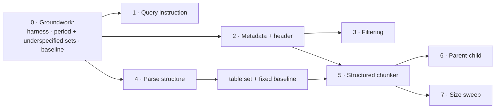

# Chunking and indexing plan

How production RAG systems chunk and index documents, where this repo stands
against that, and the phased work to close the gap. It pulls together pieces
the backlog spreads across several milestones: parsing
([14](backlog.md#milestone-14--richer-document-parsing)), chunking
([15](backlog.md#milestone-15--semantic-chunking)), filter pushdown
([20](backlog.md#milestone-20--search-quality-layer)), the size sweep
([25](backlog.md#milestone-25--chunk-size-and-overlap-sweep)) and the
underspecified question tier
([27](backlog.md#milestone-27--eval-coverage-and-judge-reliability)).
The backlog says *what*; this says *how*, in what order, and what has to be
true before each step counts as done.

Every phase follows the project's rules: selected by config behind an existing
interface, off by default until measured with the `measure-change` skill, and
no new dependency without a stated reason.

## The production methodology

Indexing is a pipeline with a contract at each stage, not a chunker with an
embedder attached. The stages, and what each is responsible for:

1. **Parse into structure.** A layout-aware parser returns typed elements —
   headings, paragraphs, lists, tables — not a flat string. Everything after
   this depends on it: information the parser discards can't be recovered by
   any later stage. Markdown is the usual interchange format (Docling,
   Unstructured and LlamaParse all export it), so one downstream chunker can
   serve every source format.
2. **Normalize.** Strip page furniture (running headers, "Table of Contents"
   links, page numbers) and fix encoding. Never rewrite content.
3. **Attach document metadata.** Entity, document type, date or period,
   source, version, access-control tags. These go in typed fields that the
   store can filter on, not only in free text.
4. **Chunk along the structure, with a size cap.** Split recursively (section,
   then paragraph, then sentence), into chunks of a few hundred tokens. Keep
   tables whole, or split them by rows with the header row repeated in every
   piece. Record each chunk's heading path. Overlap matters only where a
   fallback split cuts through prose.
5. **Assemble the index text separately from the chunk text.** What gets
   embedded and keyword-indexed is a header (document identity plus heading
   path), optionally an LLM-written context line, then the chunk. What gets
   cited is the verbatim chunk. Anthropic's "contextual retrieval" is the
   LLM-written version of this header. The deterministic version is free.
6. **Embed the way the model was trained.** Use asymmetric models as intended.
   Many need an instruction on the query side only.
7. **Store for both relevance and filtering.** Dense and sparse indexes over
   the same chunk ids, with the metadata from stage 3 queryable as predicates.
8. **Validate before publishing.** Check chunk counts and size distribution,
   tables split mid-body, empty documents, duplicates, and the index's
   settings fingerprint. Then run a retrieval eval gate.
9. **Publish atomically.** Build a new index version, validate it, switch
   readers over, and keep the old version for rollback.

What the published evidence says about stage 4 in particular:

- **Semantic (embedding-similarity) chunking isn't worth its cost.** A Vectara
  study found "the computational costs associated with semantic chunking are
  not justified by consistent performance gains" over fixed-size chunking.
- **Strategies differ by a few points of recall.** In Chroma's evaluation, all
  strategies landed at 88–92% recall. Chunk size moved precision more than
  strategy did.
- **For financial filings, document context beats boundary cleverness.**
  Snowflake found header-aware splitting beat fixed splits by 5–10% only when
  no document context was added. Prepending company, filing date and form type
  to every chunk lifted answer accuracy from about 50–60% to 72–75%, their
  largest effect. About 1,800-character chunks worked best there.

Those are other people's corpora, models and metrics. Here they are hypotheses
to measure, not results to assume.

## Where this repo stands

Measured on the `edgar` corpus on 2026-09-26 (61 filings, 4,236 chunks at the
shipped `chunk_size: 1000`, `chunk_overlap: 150`) with an ad hoc script.
Phase 0 turns it into a command.

| stage | shipped | gap |
|---|---|---|
| 1. Parse | `scripts/fetch_edgar.py` flattens HTML to text; tables become pipe rows | Headings are plain lines. A heuristic finds ~54 heading-like lines per filing, but a sample of 25 was only ~60% real headings, with the rest page furniture and table fragments. Structure has to be recovered from the HTML, not guessed from text |
| 2. Normalize | `clean_documents` | Page furniture ("Table of Contents", "Item 7") stays in the text |
| 3. Metadata | `title` (company, ticker, form, period) rides on every chunk | Title isn't a typed field, isn't filterable, and isn't in the embedded or BM25 text |
| 4. Chunk | 1,000-char windows, 150 overlap | **320 chunks (7.6%) start mid-table,** with the header row in the previous chunk. 1,337 chunks (32%) hold table rows; 55 of 61 filings have tables |
| 5. Index text | `Chunk.contextual_text` = LLM context (off) + text | No deterministic header, so a chunk from mid-filing never names its company or period |
| 6. Embed | `qwen3-embedding:0.6b`, same call for queries and documents | The model card asks for an `Instruct: …\nQuery:` prefix on queries and puts omitting it at a 1–5% loss |
| 7. Store | Chroma + BM25 over the same ids; content-hash incremental; stale-chunk purge; settings manifest | No filtering: `VectorStore.query` and `SparseIndex.query` take no predicates |
| 8. Validate | Manifest refuses mixed settings | No build report, no gate |
| 9. Publish | Rebuild in place | No versioned swap (out of scope in [Milestone 28](backlog.md#milestone-28--production-hardening)) |

Two more corpus facts that shape the plan:

- **16.5% of the corpus text is paragraphs repeated verbatim across filings**
  (437 paragraphs over 200 characters, 592k of 3.59M characters). Mostly the
  same company restating a policy or risk paragraph from one period to the
  next. These are legitimate content in each filing, so deduplicating them is
  wrong. But for "what did Apple say in FY2025", an identical FY2024 paragraph
  is an exact tie that only period metadata can break. Only 44 chunks are
  exact duplicates at the chunk level, which is negligible.
- **Where retrieval loses answers now.** At the shipped config, stage 1
  (hybrid, `top_k=20`) finds the right chunk for 88.5% of questions, and the
  reranker keeps 87.4% (`bge-reranker-v2-m3`,
  [measured results](measured-results.md#reranker-models)). So about 20 of
  the 22 misses never reach the reranker. At `top_k=100`, stage 1 finds
  97.7%: the answers are in the index, ranked 21st to 100th. Index text,
  query embedding and filters are exactly what move a chunk's first-stage
  rank.

## What to expect from the measurements

- **The generated eval set will under-report metadata work.** All 174
  questions in `edgar_eval_set.json` name their company and period, which is
  the case BM25 handles best ([Milestone 27](backlog.md#milestone-27--eval-coverage-and-judge-reliability)).
  Contextual chunking measured +6.4pp on dense retrieval and +1.7pp, within
  noise, on hybrid. Expect the deterministic header (Phase 2) to look similar.
  Filtering (Phase 3) is different: it removes the wrong-period and
  wrong-company chunks competing for the top 20, which BM25 can't do.
- **The generated set can't see two of the defects this plan targets.**
  **None of its 174 spans quotes a table row,** though 32% of chunks hold
  table rows, so the 320 mid-table chunks never show up as misses. And
  `generate_eval_set.py` drops any span that appears in more than one filing,
  which removes by construction the repeated-across-periods case that
  filtering exists for. Phase 0 adds question sets for both. Until they exist,
  Phases 3–5 can't be judged.
- **Retrieval metrics can't judge a chunker alone.** A chunk that retrieves
  well but is missing its table header answers badly. Phases that change
  chunk boundaries or what the model sees report `answer_eval` alongside
  `retrieval_eval`.
- **Chunk size changes what a hit means** (larger chunks contain more spans by
  construction). Report NDCG and prompt tokens at `rerank_top_k` next to hit
  rate, as Milestone 25 already requires.

## Phases

Rough sizes assume one person. All eval runs use local Ollama only.

### Phase 0 — Measurement groundwork (3–5 days)

Nothing below can be judged without this. The steps are ordered: no variant
gets measured until step 3 has recorded a baseline on every question set that
will judge it.

**The freeze rule.** A question set is drafted from the corpus, reviewed,
and committed *before* anything is measured on it. Questions written after
seeing which ones the current config misses make a set tuned to that config's
failures, and any change aimed at those failures would then look good. After
the commit, a set changes only to fix a label error. Record each fix in the
set's file, and re-run every variant that set has already scored, since old
and new numbers aren't comparable.

**Step 1 — Harness fixes and a label-quality check.**

- **Make span matching chunker-agnostic.** `_judge_by_span` requires a span to
  sit inside one chunk. `warn_on_unmatchable_spans` guards that with the
  overlap length, which means nothing for a chunker without overlap. Replace
  the heuristic with the real check: chunk the corpus with the configured
  chunker and count spans that no chunk contains. Report that count on every
  run as `unmatchable_spans`, so a chunker that splits answers is visibly
  penalized instead of silently scoring worse. The eval set was generated
  from the fixed chunker's chunks (`source_chunk`), so every span fits a fixed
  chunk by construction. This count is what exposes that bias.
- **Add a `span_and_document` matching mode** to `rag/eval/relevance.py`: a
  chunk counts only if it contains the span *and* comes from an expected
  document. The `period` tier needs it, because when the answer text is in two
  filings, span matching credits the wrong period's chunk as a hit.
- **`python -m rag.cli index-report`.** A read-only command printing what this
  plan measured by hand: documents and chunks, chunk-size percentiles, chunks
  under a floor or over the cap, chunks starting mid-table, documents yielding
  zero chunks, exact duplicate chunks, and the manifest. It is the stage-8
  validation gate in embryo, and it gives every later phase a before and
  after.
- **Check the existing labels.** Run
  `retrieval_eval -v --eval-set data/eval/edgar_eval_set.json --corpus edgar`
  at the shipped config and read each of the ~22 misses. The question is how
  many are label errors (another chunk states the same fact) or spans split
  across chunks. If label errors aren't rare, fix the drafting and review
  process before step 2 uses it to write 100+ new questions. Record the counts
  in `docs/measured-results.md`. This step doesn't decide what to build: it
  can only classify misses the generated set can produce, and that set has no
  table or repeated-text questions.

**Step 2 — Build, review and commit the `period` and `underspecified` sets.**

Today all 174 questions come from one generated tier: a single span in a
single filing, naming its company and period, and 128 of them start with
"What was/were". The new tiers each get their own file and are reported
separately, never averaged into the generated set's numbers:

| tier | what a question looks like | judges | built in |
|---|---|---|---|
| `period` | Asks for one filing's statement where the same text appears in another period's filing of the same company | Phase 3 | Step 2 |
| `underspecified` | Doesn't name its company or period, or paraphrases away the span's wording. This is Milestone 27's tier, pulled in here | Phases 1–2 | Step 2 |
| `table` | Answer is a cell in a table, e.g. a segment's revenue for a year | Phase 5 | After Phase 4 |

- **Draft from the corpus, never from misses.** `period` candidates are
  sampled from the 437 paragraphs repeated across filings. `underspecified`
  questions are rewrites of a random sample of generated questions with
  company and period removed. Logged turns can contribute, sampled from all
  turns and not only thumbs-down ones, which are failures of the current
  config.
- **The LLM drafts, a person labels.** `generate_eval_set.py` drafts, and a
  person checks every span and expected document. Nothing is auto-labeled,
  the rule `generate_eval_set.py` already follows.
- **50–80 questions per tier.** At 50, one hit rate is good to about ±7
  points, so a tier on its own catches only large effects. Paired
  comparisons across configs (`run_matrix.py`) are what make a tier this size
  usable. Report each tier's own noise floor next to its results.
- Drafting uses local Ollama only. Review is the real cost: about a day per
  tier.
- Commit both sets before step 3.

**Step 3 — Baseline on every set.**

Run the shipped config on the generated set, `period` and `underspecified`,
with `retrieval_eval` and `answer_eval`, and record the results with their
fingerprints in `docs/measured-results.md`. Phases 1–3 are measured against
this.

**Later — the `table` set, between Phases 4 and 5.**

Phase 4 changes how tables are rendered, so table spans written against
today's pipe rows could stop matching after the re-fetch. Build the tier on
Phase 4's corpus, spans quoting enough of the row to be unique rather than a
bare number. Commit it under the same freeze rule, then record a `fixed`
chunker baseline on it before Phase 5 is measured. Phase 4 itself is judged
by heading precision and span presence, not by this tier.

### Phase 1 — Query instruction for the embedder (half a day)

The cheapest experiment in the plan: it changes query vectors only, so there's
no reindex.

- `embedding.query_instruction: str | null` in `EmbeddingConfig`, default
  `null` (today's behaviour). `OllamaEmbedder.embed_query` formats it as the
  model card specifies: `Instruct: {instruction}\nQuery:{query}`.
  `embed_documents` never gets it. The seam already exists: the Milestone 4
  notes kept `embed_query` and `embed_documents` separate for exactly this.
- It affects only query vectors, so it stays out of the index manifest, but it
  goes into `run_matrix.py`'s result fingerprint.
- **Done when:** `run_matrix.py` compares `null` against the model card's
  retrieval instruction on EDGAR, with a paired CI. It becomes the default
  only if the CI excludes zero.

### Phase 2 — Document metadata and a deterministic chunk header (2–3 days)

- **Metadata in front matter.** `fetch_edgar.py` writes YAML front matter
  (`company`, `ticker`, `form`, `period_end`, `filed`, `accession`).
  `MarkdownLoader` parses it into `Document.metadata` and strips it from
  `Document.text`, so character offsets and eval spans are unaffected. Any
  Markdown corpus gets typed metadata this way, and PyYAML is already a
  dependency. *Quick fix, rejected:* regex-parsing the existing `# Company
  (TICKER) FORM -- period ended DATE` title. It works for EDGAR only, and
  breaks silently when the title format changes.
- **Carry configured fields onto chunks.** The chunker's hardcoded allowlist
  (`title`, `page`, `page_count`) becomes `chunking.carry_metadata`, a list.
  Chroma needs primitive values, so dates are stored as `YYYYMMDD` integers,
  which also makes range filters work in Phase 3.
- **`Chunk.index_text` replaces `contextual_text` as the thing that is
  indexed.** It is `header + context + text`. The header comes from
  `chunking.header.template`, e.g. `"{company} ({ticker}) {form}, period ended
  {period_end}"`, plus the heading path once Phase 5 provides one. Both
  `embed_documents` and `BM25Index._index_text` read it. `text` stays
  verbatim for citations, as with contextual chunking.
- **The header goes in the index manifest.** The content hash covers
  `chunk.text` only, so a template change would otherwise leave old and new
  headers mixed in one index. Same rule, and same `--reset` refusal, as
  `chunking.contextual`.
- **Show the header to the answering model.** `_citation_label` in
  `rag/generation/prompts.py` labels passages with the file name today. Use
  the header so the model sees "Apple Inc. (AAPL) 10-K, period ended
  2024-09-28". This changes the grounded prompt, so `answer_eval` runs before
  and after.
- **Done when:** retrieval and answer eval on the generated set and the
  `underspecified` tier, header on vs. off. A noise result on the generated
  set alone means only "no help on questions that name their subject". It replaces contextual
  chunking as the recommended way to put document identity into chunks if it
  matches contextual's dense gain, since it costs zero LLM calls instead of
  ~4 hours.

### Phase 3 — Metadata filtering (3–4 days)

This is Milestone 20's first item ("filter pushdown"), pulled forward because
it's the only fix for the 16.5% of text that is identical across periods.

- **Oracle experiment first, before any interface change.** The eval samples'
  `expected_doc_ids` give the correct filing. Hack an eval-only path that
  restricts retrieval to it (the ceiling for perfect filtering) and to the
  right company across all periods (a realistic filter). If the oracle
  doesn't beat 0.874 by more than noise, stop here and record that.
- **Interfaces.** A typed `QueryFilter` (equality and set membership on
  strings, ranges on integers) as an optional argument to `VectorStore.query`,
  `SparseIndex.query` and `Retriever.retrieve`. Chroma gets a `where` clause.
  BM25 filters before scoring, so a filter never returns fewer than `top_k`
  results when enough matching chunks exist. Filtering after top-k would
  silently shrink results.
- **Where filters come from.** Explicit parameters first: `POST /chat` and the
  MCP `rag_search` tool get an optional `filters` object. That's a tool-schema
  change, so update [MCP server](mcp-server.md). Extracting filters from
  question text is Milestone 20's query understanding, and an agent (Milestone
  19) can pass them itself, which is a reason to land this before 19.
- **Done when:** a paired comparison on the generated set and the `period`
  tier, with filters derived from each sample's expected company. The
  `period` tier is where filtering should show; a gain only on the generated
  set would be suspicious. Plus tests that a filtered query never returns a
  chunk outside the filter from either index.

### Phase 4 — Recover structure at parse time (2–3 days)

The chunker can only split on structure the parser kept.

- **EDGAR:** `_TextExtractor` in `fetch_edgar.py` already walks the HTML.
  Have it emit Markdown headings from what filings use as headings (bold or
  styled standalone blocks, `<h*>` where present), and Markdown tables with a
  real header row and separator line in place of bare pipe rows. Drop page
  furniture: repeated "Table of Contents" links and page numbers.
- **PDFs:** this is Milestone 14 (Docling behind the loader interface). The
  contract is the same: emit Markdown, so Phase 5's chunker serves both
  sources.
- **Re-fetching costs SEC requests.** They're free but governed by SEC's
  fair-access policy, which the fetcher already respects. Ask before
  re-fetching.
- **Risk: eval spans.** None of the existing spans quotes a table row, but
  dropping page furniture or turning lines into headings can still split a
  prose span that ran across them. After re-fetching, run the span-presence
  check on every tier. A span that no longer
  appears is fixed by adjusting the renderer or by re-generating that one
  sample, reviewed by a human. Never loosen the matcher to hide it.
- **Done when:** `index-report` shows headings detected per filing, spot-
  checked by hand on a sample like the one above (target: >90% real), and
  every eval span still matches.

### Phase 5 — Structure-aware chunker (3–4 days)

`StructuredChunker`, selected with `chunking.strategy: structured`. No new
dependency: Markdown block parsing (ATX headings, pipe tables, lists,
paragraphs) is a small hand-written pass.

- **Blocks, then packing.** Parse `Document.text` into blocks, tracking the
  heading path. Pack consecutive blocks into chunks up to `max_chars`. Never
  cross a heading at or above `split_level`. Merge a section under
  `min_chars` into its next sibling so a heading never becomes a chunk alone.
- **Tables.** A table that fits is one block. A larger one is split by rows,
  and every piece repeats the header rows. The target is `index-report`
  showing zero chunks starting mid-table (320 today).
- **Fallback for oversized prose.** A paragraph over `max_chars` is split
  recursively: sentences, then words. Only here does `chunk_overlap` apply.
- **Metadata.** `section_path` (e.g. `MD&A > Liquidity and Capital
  Resources`), a `block_types` summary, and `char_start`/`char_end` as today.
  `section_path` feeds Phase 2's header.
- **Sizes in characters, measured and stated.** Tokens are what production
  systems cap on, but a 1,000-character chunk sits far below any embedder
  limit here. A token length function becomes necessary with a hosted
  embedder that has a hard limit (Milestone 18). Make the length function
  injectable now, and ship characters.
- **Done when:** `structured` vs. `fixed`, each built into its own `index_dir`
  (the `data/eval/config_contextual.yaml` pattern), on the generated set and
  the `table` tier. Report retrieval eval,
  `answer_eval`, `unmatchable_spans`, chunk-size distribution and prompt
  tokens at `rerank_top_k`. It becomes the default only if answer quality
  improves and retrieval doesn't regress beyond noise.

### Phase 6 — Parent-child expansion (optional, 2 days)

Search small chunks, show the model their section. It sits behind `Retriever`
as a step after reranking, not in the chunker (as the Milestone 15 entry
already says). It needs Phase 5's section boundaries. The prompt grows, so
set a character budget per passage. Judge it with `answer_eval` only:
retrieval metrics barely move, by construction.

### Phase 7 — Size sweep on the winning strategy

This is Milestone 25, run on whichever chunker Phase 5 leaves as the default
rather than on `fixed`. The Snowflake result (~1,800 characters best) is one
point worth including in the grid.

## Indexing operations

These run through every phase rather than being one.

- **Lineage on every chunk.** Store `parser_version` and a chunker fingerprint
  (strategy plus parameters) in chunk metadata. `index-report` flags an index
  holding more than one. The manifest guards settings that don't change chunk
  text; lineage shows which settings produced the text that's there.
- **A validation gate before an index counts as built.** `index-report` with
  thresholds from config (zero-chunk documents, oversized chunks, mid-table
  starts), failing the command when crossed. Milestone 23's retrieval gate is
  the second half.
- **Repeated text is kept, not deduplicated.** The 16.5% repeated across
  filings belongs to each filing. Metadata filters and the header disambiguate
  it. Exact duplicate chunks (44) aren't worth handling.
- **Chunk ids stay positional (`<doc>::chunk<n>`).** An edit near the start of
  a document then shifts every later id and re-embeds the rest. That's fine
  here: filings are immutable, and a new filing is a new document. For a
  mutable corpus, reuse vectors by content hash across ids. Never namespace
  document ids: that invalidates `expected_doc_ids`.
- **Versioned publish stays out of scope** until reindexing is scheduled, as
  Milestone 28 already states. The trigger is the first scheduled rebuild.

## Decisions and rejected alternatives

- **Semantic chunking isn't planned.** Milestone 15 as written (cut where
  adjacent-sentence similarity drops) is the option the external evidence
  supports least. The one boundary defect measured here, tables split from
  their headers, is fixed by structure rather than by similarity cuts, and
  Phase 0's `unmatchable_spans` count shows whether prose splits are costing
  anything. Structure-aware chunking replaces it as that milestone's content.
- **LLM-driven chunking is rejected** for the cost reason contextual chunking
  measured: one LLM call per chunk, about 4 hours for EDGAR.
- **Late chunking is rejected for now.** It embeds the whole document, then
  pools token vectors per chunk, and needs token-level embeddings, which
  Ollama's `/api/embed` doesn't return. Revisit with the
  `sentence_transformers` embedder from Milestone 18.
- **Contextual chunking stays off.** Phase 2's header is the cheap test of
  the same idea. If the header matches contextual's gain, contextual isn't
  worth re-running on this corpus.
- **Page-image retrieval (ColPali)** stays where Milestone 14 put it: an
  adapter if text parsing proves insufficient.

## Order and why

Phase 0 comes first because every later verdict depends on it: a phase judged
only on the generated set can't show an effect on the questions it exists
for, which is how contextual chunking was recorded as noise.

Phase 1 is nearly free and needs no reindex. Phases 2–3 target the failure
this corpus is built to produce: near-identical filings that differ by
company and period, and their question sets exist after Phase 0. Phases 4–5
fix a measured defect (320 mid-table chunks) but cost the most, and there is
no way to measure whether that defect costs answers until the `table` set
exists, after Phase 4. So 1–3 go first by default. If the step-1 label check
turns up misses that are table-shaped anyway, that is a reason to start 4–5
earlier, not a measurement of their value.

## Open questions

- Does the reranker see the header? Showing `index_text` to the cross-encoder
  gives it the period, which it can't see now. It also changes what every
  reranker measurement means. Measure both.
- Heading recovery from filing HTML is heuristic, like the MD&A extraction.
  If it can't reach >90% precision, is a heading-free structured chunker
  (tables atomic, paragraphs packed) enough on its own?
- Should `filters` on `/chat` be exposed in the Streamlit UI, or stay API/MCP
  only until Milestone 20's query understanding can fill them?

## Sources

- [Chroma: Evaluating Chunking Strategies for Retrieval](https://www.trychroma.com/research/evaluating-chunking)
- [Is Semantic Chunking Worth the Computational Cost? (arXiv 2410.13070)](https://arxiv.org/abs/2410.13070)
- [Snowflake: How Retrieval & Chunking Impact Finance RAG](https://www.snowflake.com/en/engineering-blog/impact-retrieval-chunking-finance-rag/)
- [Financial Report Chunking for Effective RAG (arXiv 2402.05131)](https://arxiv.org/abs/2402.05131)
- [Qwen3-Embedding-0.6B model card](https://huggingface.co/Qwen/Qwen3-Embedding-0.6B) (query instruction)
