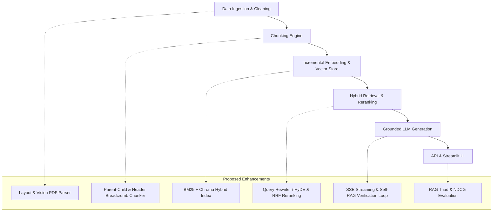
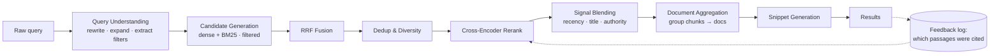

# Repository Improvement Recommendations & Architectural Analysis for `rag-toolkit`

This document provides a comprehensive roadmap of actionable improvements and a real-world architectural gap analysis for the **`rag-toolkit`** repository.

The project demonstrates a clean design, interface-driven architecture, and solid test coverage (139 passing unit tests). To evolve this baseline into a production-grade RAG platform capable of handling real-world edge cases, the improvements below address canonical RAG theory alongside production realities.

---

## Architecture Overview

### Target search-quality layer (Priority 4)

The pipeline above is a *RAG* shape: one query in, `rerank_top_k` chunks out.
A *search-engine* shape inserts a query-understanding stage before retrieval
and a result-assembly stage after ranking:

---

## Architectural Gap Analysis (Naive vs. Production RAG)

| Pipeline Stage | `rag-toolkit` Current Implementation | Real-World Failure Mode | Production-Grade Solution |
|---|---|---|---|
| **Ingestion** | Plain-text extraction via `pypdf` | Destroys tables, multi-column layouts, and discards embedded diagrams | Layout-aware parsers (PyMuPDF, Docling) or Vision-Language page embeddings |
| **Chunking** | Character sliding window snapped to space | Breaks sentences mid-thought; loses section hierarchy | Parent-Child (Hierarchical) Chunking & Header Breadcrumbs |
| **Querying** | Raw single string query | Ambiguous or follow-up queries fail vector lookup | Multi-turn Query Rewriting, HyDE, & Multi-Query Expansion |
| **Retrieval** | Dense Cosine Vector search only | Misses exact keyword matches (SKUs, code IDs, names) | Hybrid Search: BM25 + Vector Search via Reciprocal Rank Fusion (RRF) |
| **Generation** | Returns all retrieved chunks as citations | Unverifiable citations; Lost-in-the-Middle context degradation | Active Citation Tagging & Lost-in-the-Middle mitigation |
| **Verification** | Single-pass prompt generation | Risk of LLM hallucination when context is weak | Self-RAG / Corrective RAG Groundedness Loop |
| **Filtering** | `VectorStore.query(embedding, top_k)` — no filter argument | Cannot scope a search by date, doc type, or subdirectory | Structured filter predicates pushed down to Chroma `where` + BM25 |
| **Ranking signals** | Score is purely query–chunk semantic similarity | Stale or low-quality documents outrank fresh, authoritative ones | Query-independent priors: recency, title match, corpus link graph |
| **Result unit** | Returns *N* chunks | Top-*k* fills with near-duplicate chunks from one document section | Document-level aggregation with best-passage snippet + MMR diversity |
| **Learning** | No logging of which results proved useful | Ranking never improves from usage; no training data ever accumulates | Log LLM citation choices as implicit relevance judgments |

---

## Priority 1: Ingestion, Chunking & Retrieval Quality

### 1. Hybrid Search (BM25 + Dense Vector Search via RRF)
* **Problem**: Pure vector search can fail on exact keyword queries (acronyms, code identifiers, product model numbers, specific names).
* **Solution**: Implement a hybrid retriever combining sparse BM25 keyword search with dense vector similarity via **Reciprocal Rank Fusion (RRF)**:
  $$\text{RRF\_Score}(d) = \sum_{m \in M} \frac{1}{k + r_m(d)}$$
* **Implementation Plan**:
  - Add a lightweight BM25 indexer (e.g. using `rank_bm25` or `tantivy`) alongside `ChromaVectorStore`.
  - Create `HybridRetriever` conforming to the existing `Retriever` interface.

### 2. Layout-Aware & Vision PDF Ingestion
* **Problem**: `PyPDFLoader` strips text streams without recognizing multi-column text, headers/footers, or embedded tables.
* **Solution**:
  - Integrate layout-aware PDF parsers (such as `PyMuPDF`/`fitz`, `docling`, or `unstructured`) that retain table structures as Markdown/HTML tables.
  - Optionally support page screenshot embeddings via Vision-Language models (e.g., *ColPali*).

### 3. Parent-Child (Hierarchical) & Header Breadcrumb Chunking
* **Problem**: `FixedSizeChunker` snaps to character boundaries. Small chunks lack section context, while large chunks dilute vector search precision.
* **Solution**:
  - Implement **Parent-Child Chunking**: embed small child chunks (150–200 tokens) for search accuracy, but return the surrounding parent chunk (800–1200 tokens) to the LLM.
  - Inject section breadcrumbs (e.g., `Document > Chapter 4 > Section 4.2`) into chunk metadata.

### 4. Incremental Indexing & Change Detection
* **Problem**: Running `python -m rag.cli index` re-embeds all chunks from scratch every time, causing unnecessary HTTP round-trips to Ollama for unchanged files.
* **Solution**:
  - Compute a content hash (SHA-256) of each chunk/document.
  - Store hash metadata in Chroma; skip upserting and embedding chunks whose text hash matches existing records in the index.

---

## Priority 2: Query Transformation & API Capabilities

### 1. Conversational Query Rewriting & HyDE Expansion
* **Problem**: `ChatService.ask(query)` is stateless. Follow-up user queries ("How do I install it?") fail vector retrieval because context from prior turns is missing.
* **Solution**:
  - Add a **Query Reformulator**: use the LLM to rewrite multi-turn user queries into standalone search queries based on chat history.
  - Implement **HyDE (Hypothetical Document Embeddings)** and Multi-Query Expansion for complex queries.

### 2. Streaming Server-Sent Events (SSE) Response Endpoint
* **Problem**: The FastAPI `/chat` endpoint and Streamlit UI currently wait for the entire generation call to finish before returning text, leading to high latency perception for long answers.
* **Solution**:
  - Add `LLMClient.generate_stream(prompt, system=None)` yielding token chunks.
  - Expose a `POST /chat/stream` endpoint returning `text/event-stream` SSE tokens.
  - Update `rag/ui/app.py` to render answers incrementally via Streamlit's `st.write_stream`.

### 3. Active Citation Filtering & Lost-in-the-Middle Mitigation
* **Problem**: `ChatService` currently returns all retrieved `top_k` passages in `ChatAnswer.citations`, even if the LLM only referenced `Passage [1]` and ignored `Passage [2]`.
* **Solution**:
  - Parse `[1]`, `[2]` citation tags out of the generated answer text.
  - Annotate citations with `is_cited: bool` or filter `citations` to only return sources actively referenced in the model's output.

### 4. Additional LLM & Embedding Adapters
* **Problem**: `LLMConfig` supports `anthropic` and `openai` in validation, but provider factories raise a runtime error.
* **Solution**:
  - Implement `OpenAILLMClient` and `AnthropicLLMClient` in `rag/generation/adapters/` using direct `httpx` calls or standard SDKs.
  - Implement `OpenAIEmbedder` and `SentenceTransformersEmbedder` for native PyTorch / HuggingFace local embeddings without running Ollama.

---

## Priority 3: Evaluation Suite & Verification Guardrails

### 1. Self-RAG & Corrective Groundedness Verification
* **Problem**: Single-pass prompt generation risks returning hallucinated statements when retrieved context is weak or incomplete.
* **Solution**:
  - Implement a post-generation verification step (**Self-RAG**): ask an evaluator LLM to check if the generated claims are strictly entailed by the context before returning output to the user.

### 2. Advanced Retrieval Metrics (NDCG@K and MAP)
* **Current Metrics**: Hit Rate, Recall@K, Precision@K, MRR.
* **Proposed Enhancement**:
  - Add **NDCG@K** (Normalized Discounted Cumulative Gain) in `rag/eval/metrics.py` to evaluate whether higher-relevance documents appear earlier in retrieved results.
  - Add **MAP** (Mean Average Precision) for multi-relevant-document evaluation.

### 3. RAG Triad Evaluation Metrics
* **Current Metrics**: Binary `PASS`/`FAIL` answer evaluation via LLM-as-judge comparing answer against `expected_answer`.
* **Proposed Enhancement**: Implement the RAG Triad metrics (can run without ground-truth answers):
  1. **Faithfulness / Groundedness**: Verify whether claims in the generated response are strictly backed by the context chunks.
  2. **Answer Relevance**: Measure how directly the answer addresses the user's question.
  3. **Context Relevance**: Assess what fraction of retrieved chunks are actually pertinent to the query.

### 4. Synthetic Benchmark Dataset Generator
* **Solution**: Add a CLI command `python -m rag.cli generate-eval` that scans corpus documents and uses an LLM to generate `(query, expected_doc_ids, expected_answer)` triples for automated eval dataset creation.

---

## Priority 4: Web-Search-Engine Capabilities (Search-Quality Layer)

The components below turn the current RAG retriever into something closer to a
search engine over the corpus. Hybrid retrieval (Priority 1.1) supplied the
*candidate generation* half; what follows is the query-understanding layer that
precedes it and the ranking/assembly layer that follows it.

**Ordering note**: 4.1 changes shared interfaces (`VectorStore.query`,
`SparseIndex.query`, `Retriever.retrieve`), so it is cheapest to land before
4.2–4.9 build on top of it.

### 1. Structured Query Object & Filter Pushdown
* **Problem**: `Retriever.retrieve(query: str)` passes a raw string straight to
  `embed_query` and `tokenize`. Neither `VectorStore.query(embedding, top_k)`
  nor `SparseIndex.query(query, top_k)` accepts filter predicates, so there is
  no way to express "PDFs only", "this subdirectory", or "modified since March"
  — despite Chroma supporting `where` clauses natively.
* **Solution**:
  - Introduce a typed `Query` object (`text`, `expansions`, `filters`, `intent`)
    as the pipeline's unit of input in place of `str`.
  - Add a `filters: QueryFilter | None` parameter to `VectorStore.query` and
    `SparseIndex.query`; push predicates down into Chroma's `where` clause and
    apply them as a pre-filter over BM25 records.
  - Parse operators out of raw query text (`type:pdf`, `after:2026-01-01`,
    `path:handbook/`) in the query layer, mirroring web-search syntax.
* **Touches**: new `rag/query/`, plus `rag/vectorstore/base.py`,
  `rag/vectorstore/chroma_store.py`, `rag/retrieval/sparse.py`,
  `rag/retrieval/retriever.py`.

### 2. Query Understanding Pipeline
* **Problem**: No spell correction, stopword handling, expansion, or intent
  classification exists between the user's keystrokes and `embed_query`.
* **Solution**:
  - Define a `QueryProcessor` ABC producing a `Query` from raw text, with
    composable implementations (normalization, spell correction, expansion).
  - Implement an LLM-backed rewriter reusing the existing `LLMClient` — this
    subsumes the HyDE / multi-turn rewriting work in Priority 2.1 and should
    share one interface with it rather than duplicating the seam.
  - Classify intent (navigational / factual / exploratory) to vary `top_k` and
    reranking depth per query.

### 3. Document-Level Aggregation
* **Problem**: The pipeline returns *chunks*; search engines return *documents*
  with a best-matching passage. The eval suite already matches at document level
  (`chunk.document_id`), which exposes the mismatch.
* **Solution**:
  - Add an aggregation stage that groups `ScoredChunk`s by `document_id`, scores
    each document (max, or sum of its top-*n* chunk scores), and keeps the
    winning chunk as its representative passage.
  - Return a `ScoredDocument` carrying the document, its score, and its best
    passages — so the UI and API can render a search-result list, not a chunk list.

### 4. Query-Independent Ranking Signals
* **Problem**: Every score produced is pure query–document similarity. There is
  no notion that one document might simply be *better* than another. This is the
  single largest conceptual gap versus a real search engine.
* **Solution** — add a `SignalBlender` stage between reranking and final ordering
  that combines the semantic score with static priors:
  - **Recency**: capture file mtime and any parsed document date at ingestion
    (neither is stored today) and decay scores over age.
  - **Structural position**: boost matches landing in a title or Markdown
    heading. `title` already rides along in `Chunk.metadata` and is currently
    unused for scoring.
  - **Corpus link graph**: Markdown documents cross-reference each other; extract
    those links at ingestion and run PageRank over the intra-corpus graph to
    derive an authority prior.
  - **Document quality prior**: length, structural completeness, curation tier.

### 5. Relevance Feedback Loop
* **Problem**: Nothing records which results proved useful, so ranking cannot
  improve with use. Behavioral signal is what most distinguishes production
  search quality, and none is being captured.
* **Solution**:
  - `ChatService` already knows which passages the model cited as `[n]` — treat
    those as *implicit relevance judgments* and log
    `(query, candidates_shown, cited_chunk_ids)` on every request.
  - Surface explicit thumbs-up/down in the Streamlit UI as a second signal.
  - Once enough judgments accumulate, train a learning-to-rank model behind the
    existing `Reranker` interface, and feed the log back into the eval set.
* **Note**: worth landing early regardless of priority — its value compounds with
  the amount of data collected, so every week without it is lost signal.

### 6. Snippet Generation & Highlighting
* **Problem**: Full chunk text (~1000 chars under current config) is returned to
  both the prompt and the UI, whether or not the relevant span is 40 chars long.
* **Solution**:
  - Add a `Snippetter` that selects the best query-biased sentence window within
    a chunk and marks matched terms for highlighting.
  - Reduces prompt token consumption and improves UI scannability.

### 7. Deduplication & Diversity (MMR)
* **Problem**: `chunk_overlap: 150` guarantees adjacent chunks share text, so
  near-identical results consume the `rerank_top_k: 5` budget. Nothing enforces
  variety across documents either.
* **Solution**:
  - Collapse near-duplicates post-fusion via SimHash/MinHash or an embedding
    cosine threshold.
  - Apply Maximal Marginal Relevance or a per-document result cap so the final
    set spans multiple sources.

### 8. BM25F: Field Weighting, Stemming & Stopwords
* **Problem**: `BM25Index` tokenizes flat `chunk.text` with a bare regex — no
  stemming, no stopword list, and no distinction between a match in a title and
  one buried in body text.
* **Solution**:
  - Add stemming and a stopword list to `tokenize()` (shared by index and query
    paths, so both stay consistent).
  - Move to BM25F with per-field weights over title, headings, and body.

### 9. Query Result Caching
* **Problem**: Identical repeat queries re-embed and re-search from scratch.
* **Solution**: Cache normalized-query → results with a TTL, invalidated on index
  writes.

### 10. Deletion Support Across Both Indexes
* **Problem**: Neither `VectorStore` nor `SparseIndex` exposes a `delete(ids)`
  method. Documents removed from the corpus leave orphaned vectors and BM25
  records permanently. The in-flight incremental indexing work (Priority 1.4)
  handles *changed* documents but not *deleted* ones.
* **Solution**:
  - Add `delete(ids: list[str])` to both ABCs and their adapters.
  - During indexing, diff the set of chunk ids present in the corpus against
    those in each index and purge the difference.

### 11. Scalable Sparse Index Backend
* **Problem**: `BM25Index` holds every chunk's text in a Python dict, persists as
  a single JSON blob, and rebuilds the entire Okapi index on the next query after
  any upsert. Workable at 10³–10⁴ chunks; degrades badly beyond ~10⁵.
* **Solution**: Implement a SQLite FTS5 or Tantivy backend behind the existing
  `SparseIndex` ABC — the interface was designed for exactly this substitution,
  so no pipeline code should change.

---

## Priority 5: Developer Experience, Tooling & Security

### 1. Automated Linting, Formatting, & Typing CI Integration
* Add standard configuration files:
  - `pyproject.toml` sections for `ruff` (linter/formatter) and `mypy` (strict type checking).
  - Pre-commit hook or Makefile target: `make check` running `pytest`, `ruff check`, `mypy rag`.

### 2. Prompt Injection Guardrails
* Wrap user query inputs in clear delimiter blocks (e.g. `<user_query>...</user_query>`) inside `build_rag_prompt` to prevent prompt injection attacks that attempt to override system prompt boundaries.

### 3. Containerization (Docker & Docker Compose)
* Provide a `docker-compose.yml` to orchestrate:
  - Ollama service pre-pulling `qwen3-embedding:0.6b` and `qwen3.5:4b`.
  - FastAPI server container.
  - Streamlit UI container.

### 4. Dead Code Cleanup in `VectorStore`
* **Problem**: `VectorStore.get_metadatas` in `rag/vectorstore/base.py` returns
  `{}` and is then followed by an orphaned docstring and an unreachable
  `raise NotImplementedError` (apparently pasted from `upsert`). The method reads
  as abstract when it is in fact a concrete default.
* **Solution**: Delete the unreachable block so the default implementation's
  contract is unambiguous.

---

## Summary Matrix of All Proposed Features

| Feature | Target Component | Complexity | Impact | Status |
|---|---|---|---|---|
| **Hybrid Search (BM25 + RRF)** | `rag/retrieval/` | Medium | High (Recall & Keyword accuracy) | Shipped |
| **Incremental Indexing** | `rag/vectorstore/` | Low | High (Indexing speed) | In progress |
| **Docker Compose Setup** | Root | Low | High (Deployment ease) | In progress |
| **CI (lint / type / test)** | `.github/workflows/` | Low | Medium (Regression safety) | In progress |
| **Structured Query Object & Filter Pushdown** | `rag/query/`, `rag/vectorstore/`, `rag/retrieval/` | Medium | High (Unblocks 4.2–4.9) | Planned |
| **Query Understanding Pipeline** | `rag/query/` | Medium | High (Retrieval accuracy) | Planned |
| **Document-Level Aggregation** | `rag/retrieval/` | Medium | High (Result quality & UX) | Planned |
| **Query-Independent Ranking Signals** | `rag/retrieval/`, `rag/ingestion/` | High | High (Ranking quality) | Planned |
| **Relevance Feedback Loop** | `rag/generation/`, `rag/eval/` | Medium | High (Compounding ranking gains) | Planned |
| **Snippet Generation & Highlighting** | `rag/retrieval/`, `rag/ui/` | Low | Medium (Token cost & scannability) | Planned |
| **Deduplication & Diversity (MMR)** | `rag/retrieval/` | Low | High (Wasted rerank budget) | Planned |
| **BM25F / Stemming / Stopwords** | `rag/retrieval/sparse.py` | Medium | Medium (Lexical precision) | Planned |
| **Query Result Caching** | `rag/retrieval/` | Low | Medium (Latency) | Planned |
| **Index Deletion Support** | `rag/vectorstore/`, `rag/retrieval/sparse.py` | Low | Medium (Index correctness) | Planned |
| **Scalable Sparse Backend (FTS5 / Tantivy)** | `rag/retrieval/sparse.py` | Medium | Medium (Scale ceiling) | Planned |
| **Conversational Query Rewriting / HyDE** | `rag/query/`, `rag/retrieval/` | Medium | High (Multi-turn UX & Retrieval accuracy) | Planned |
| **Layout-Aware PDF Ingestion** | `rag/ingestion/` | Medium | High (Table & Structure preservation) | Planned |
| **Parent-Child Chunking & Breadcrumbs** | `rag/chunking/` | Medium | High (Context quality) | Planned |
| **SSE Streaming Response** | `rag/api/`, `rag/ui/` | Medium | High (Perceived latency) | Planned |
| **Active Citation & Groundedness Verification** | `rag/generation/` | Low | High (Answer fidelity & trust) | Planned |
| **RAG Triad & NDCG Metrics** | `rag/eval/` | Medium | High (Eval rigor) | Planned |
| **OpenAI / Anthropic Adapters** | `rag/generation/`, `rag/embedding/` | Low | Medium (Flexibility) | Planned |

---

## Suggested Build Order for Priority 4

1. **Structured `Query` object + filter pushdown** (4.1) — ripples through the most
   interfaces, so it is cheapest before anything else builds on them.
2. **Document aggregation + dedup/diversity** (4.3, 4.7) — the largest immediate
   win in visible result quality.
3. **Static ranking signals** (4.4) — start with title-match boost and recency;
   the link graph can follow.
4. **Snippets** (4.6).
5. **Relevance feedback logging** (4.5) — cheap to add and starts accumulating
   training data immediately; can be pulled earlier for that reason alone.
6. **BM25F, stemming, stopwords** (4.8).
7. **Deletion support** (4.10) — pair with the incremental indexing work.
8. **FTS5 / Tantivy backend** (4.11) — only once corpus scale demands it.
