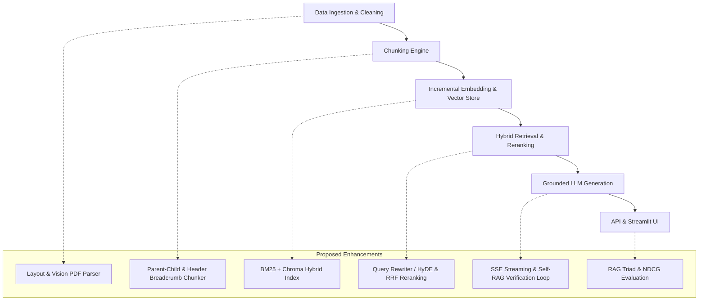

# Repository Improvement Recommendations & Architectural Analysis for `rag-toolkit`

This document provides a comprehensive roadmap of actionable improvements and a real-world architectural gap analysis for the **`rag-toolkit`** repository.

The project demonstrates a clean design, interface-driven architecture, and solid test coverage (139 passing unit tests). To evolve this baseline into a production-grade RAG platform capable of handling real-world edge cases, the improvements below address canonical RAG theory alongside production realities.

---

## Architecture Overview

---

## Architectural Gap Analysis (Naive vs. Production RAG)

| Pipeline Stage | `rag-toolkit` Current Implementation | Real-World Failure Mode | Production-Grade Solution |
|---|---|---|---|
| **Ingestion** | Plain-text extraction via `pypdf` | Destroys tables, multi-column layouts, and discards embedded diagrams | Layout-aware parsers (PyMuPDF, Docling) or Vision-Language page embeddings |
| **Chunking** | Character sliding window snapped to space | Breaks sentences mid-thought; loses section hierarchy | Parent-Child (Hierarchical) Chunking & Header Breadcrumbs |
| **Querying** | Raw single string query | Ambiguous or follow-up queries fail vector lookup | Multi-turn Query Rewriting, HyDE, & Multi-Query Expansion |
| **Retrieval** | Dense Cosine Vector search only | Misses exact keyword matches (SKUs, code IDs, names) | Hybrid Search: BM25 + Vector Search via Reciprocal Rank Fusion (RRF) |
| **Generation** | Returns all retrieved chunks as citations | Unverifiable citations; Lost-in-the-Middle context degradation | Active Citation Tagging & Lost-in-the-Middle mitigation |
| **Verification** | Single-pass prompt generation | Risk of LLM hallucination when context is weak | Self-RAG / Corrective RAG Groundedness Loop |

---

## Priority 1: Ingestion, Chunking & Retrieval Quality

### 1. Hybrid Search (BM25 + Dense Vector Search via RRF)
* **Problem**: Pure vector search can fail on exact keyword queries (acronyms, code identifiers, product model numbers, specific names).
* **Solution**: Implement a hybrid retriever combining sparse BM25 keyword search with dense vector similarity via **Reciprocal Rank Fusion (RRF)**:
  $$\text{RRF\_Score}(d) = \sum_{m \in M} \frac{1}{k + r_m(d)}$$
* **Implementation Plan**:
  - Add a lightweight BM25 indexer (e.g. using `rank_bm25` or `tantivy`) alongside `ChromaVectorStore`.
  - Create `HybridRetriever` conforming to the existing `Retriever` interface.

### 2. Layout-Aware & Vision PDF Ingestion
* **Problem**: `PyPDFLoader` strips text streams without recognizing multi-column text, headers/footers, or embedded tables.
* **Solution**:
  - Integrate layout-aware PDF parsers (such as `PyMuPDF`/`fitz`, `docling`, or `unstructured`) that retain table structures as Markdown/HTML tables.
  - Optionally support page screenshot embeddings via Vision-Language models (e.g., *ColPali*).

### 3. Parent-Child (Hierarchical) & Header Breadcrumb Chunking
* **Problem**: `FixedSizeChunker` snaps to character boundaries. Small chunks lack section context, while large chunks dilute vector search precision.
* **Solution**:
  - Implement **Parent-Child Chunking**: embed small child chunks (150–200 tokens) for search accuracy, but return the surrounding parent chunk (800–1200 tokens) to the LLM.
  - Inject section breadcrumbs (e.g., `Document > Chapter 4 > Section 4.2`) into chunk metadata.

### 4. Incremental Indexing & Change Detection
* **Problem**: Running `python -m rag.cli index` re-embeds all chunks from scratch every time, causing unnecessary HTTP round-trips to Ollama for unchanged files.
* **Solution**:
  - Compute a content hash (SHA-256) of each chunk/document.
  - Store hash metadata in Chroma; skip upserting and embedding chunks whose text hash matches existing records in the index.

---

## Priority 2: Query Transformation & API Capabilities

### 1. Conversational Query Rewriting & HyDE Expansion
* **Problem**: `ChatService.ask(query)` is stateless. Follow-up user queries ("How do I install it?") fail vector retrieval because context from prior turns is missing.
* **Solution**:
  - Add a **Query Reformulator**: use the LLM to rewrite multi-turn user queries into standalone search queries based on chat history.
  - Implement **HyDE (Hypothetical Document Embeddings)** and Multi-Query Expansion for complex queries.

### 2. Streaming Server-Sent Events (SSE) Response Endpoint
* **Problem**: The FastAPI `/chat` endpoint and Streamlit UI currently wait for the entire generation call to finish before returning text, leading to high latency perception for long answers.
* **Solution**:
  - Add `LLMClient.generate_stream(prompt, system=None)` yielding token chunks.
  - Expose a `POST /chat/stream` endpoint returning `text/event-stream` SSE tokens.
  - Update `rag/ui/app.py` to render answers incrementally via Streamlit's `st.write_stream`.

### 3. Active Citation Filtering & Lost-in-the-Middle Mitigation
* **Problem**: `ChatService` currently returns all retrieved `top_k` passages in `ChatAnswer.citations`, even if the LLM only referenced `Passage [1]` and ignored `Passage [2]`.
* **Solution**:
  - Parse `[1]`, `[2]` citation tags out of the generated answer text.
  - Annotate citations with `is_cited: bool` or filter `citations` to only return sources actively referenced in the model's output.

### 4. Additional LLM & Embedding Adapters
* **Problem**: `LLMConfig` supports `anthropic` and `openai` in validation, but provider factories raise a runtime error.
* **Solution**:
  - Implement `OpenAILLMClient` and `AnthropicLLMClient` in `rag/generation/adapters/` using direct `httpx` calls or standard SDKs.
  - Implement `OpenAIEmbedder` and `SentenceTransformersEmbedder` for native PyTorch / HuggingFace local embeddings without running Ollama.

---

## Priority 3: Evaluation Suite & Verification Guardrails

### 1. Self-RAG & Corrective Groundedness Verification
* **Problem**: Single-pass prompt generation risks returning hallucinated statements when retrieved context is weak or incomplete.
* **Solution**:
  - Implement a post-generation verification step (**Self-RAG**): ask an evaluator LLM to check if the generated claims are strictly entailed by the context before returning output to the user.

### 2. Advanced Retrieval Metrics (NDCG@K and MAP)
* **Current Metrics**: Hit Rate, Recall@K, Precision@K, MRR.
* **Proposed Enhancement**:
  - Add **NDCG@K** (Normalized Discounted Cumulative Gain) in `rag/eval/metrics.py` to evaluate whether higher-relevance documents appear earlier in retrieved results.
  - Add **MAP** (Mean Average Precision) for multi-relevant-document evaluation.

### 3. RAG Triad Evaluation Metrics
* **Current Metrics**: Binary `PASS`/`FAIL` answer evaluation via LLM-as-judge comparing answer against `expected_answer`.
* **Proposed Enhancement**: Implement the RAG Triad metrics (can run without ground-truth answers):
  1. **Faithfulness / Groundedness**: Verify whether claims in the generated response are strictly backed by the context chunks.
  2. **Answer Relevance**: Measure how directly the answer addresses the user's question.
  3. **Context Relevance**: Assess what fraction of retrieved chunks are actually pertinent to the query.

### 4. Synthetic Benchmark Dataset Generator
* **Solution**: Add a CLI command `python -m rag.cli generate-eval` that scans corpus documents and uses an LLM to generate `(query, expected_doc_ids, expected_answer)` triples for automated eval dataset creation.

---

## Priority 4: Developer Experience, Tooling & Security

### 1. Automated Linting, Formatting, & Typing CI Integration
* Add standard configuration files:
  - `pyproject.toml` sections for `ruff` (linter/formatter) and `mypy` (strict type checking).
  - Pre-commit hook or Makefile target: `make check` running `pytest`, `ruff check`, `mypy rag`.

### 2. Prompt Injection Guardrails
* Wrap user query inputs in clear delimiter blocks (e.g. `<user_query>...</user_query>`) inside `build_rag_prompt` to prevent prompt injection attacks that attempt to override system prompt boundaries.

### 3. Containerization (Docker & Docker Compose)
* Provide a `docker-compose.yml` to orchestrate:
  - Ollama service pre-pulling `qwen3-embedding:0.6b` and `qwen3.5:4b`.
  - FastAPI server container.
  - Streamlit UI container.

---

## Summary Matrix of All Proposed Features

| Feature | Target Component | Complexity | Impact |
|---|---|---|---|
| **Hybrid Search (BM25 + RRF)** | `rag/retrieval/` | Medium | High (Recall & Keyword accuracy) |
| **Conversational Query Rewriting / HyDE** | `rag/retrieval/` | Medium | High (Multi-turn UX & Retrieval accuracy) |
| **Layout-Aware PDF Ingestion** | `rag/ingestion/` | Medium | High (Table & Structure preservation) |
| **Parent-Child Chunking & Breadcrumbs** | `rag/chunking/` | Medium | High (Context quality) |
| **Incremental Indexing** | `rag/vectorstore/` | Low | High (Indexing speed) |
| **SSE Streaming Response** | `rag/api/`, `rag/ui/` | Medium | High (Perceived latency) |
| **Active Citation & Groundedness Verification** | `rag/generation/` | Low | High (Answer fidelity & trust) |
| **RAG Triad & NDCG Metrics** | `rag/eval/` | Medium | High (Eval rigor) |
| **OpenAI / Anthropic Adapters** | `rag/generation/`, `rag/embedding/` | Low | Medium (Flexibility) |
| **Docker Compose Setup** | Root | Low | High (Deployment ease) |
